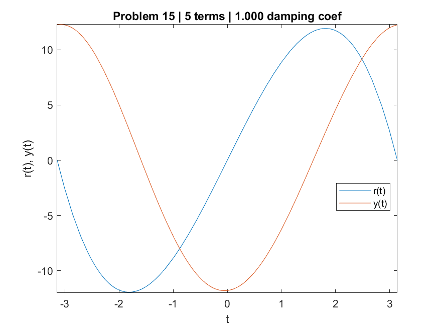
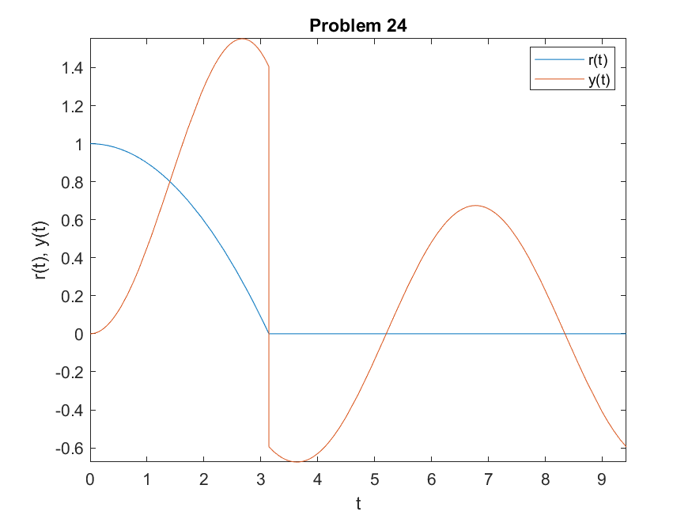
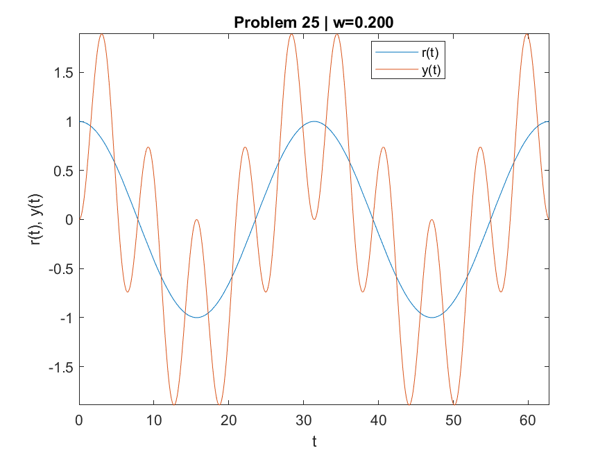
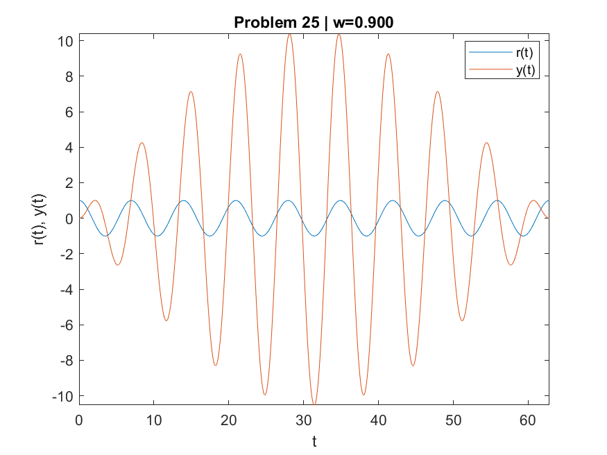
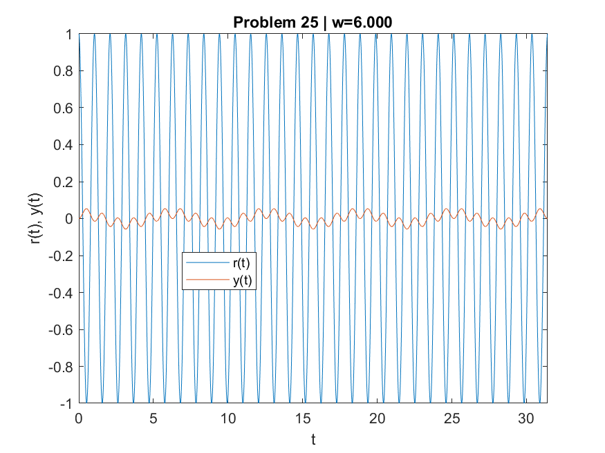
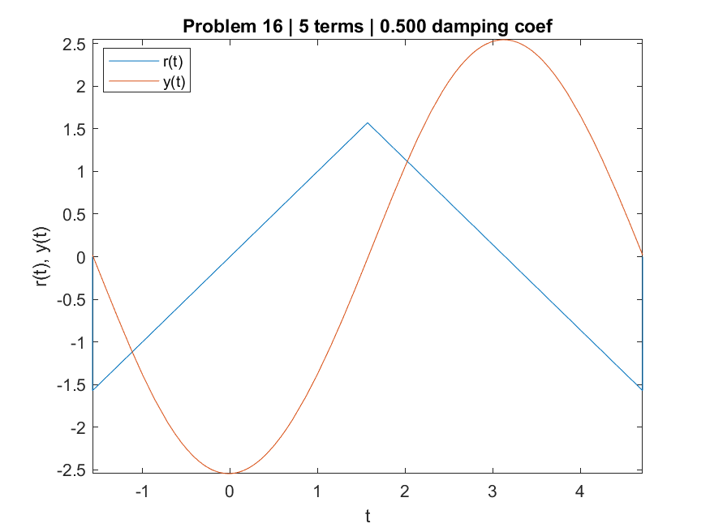
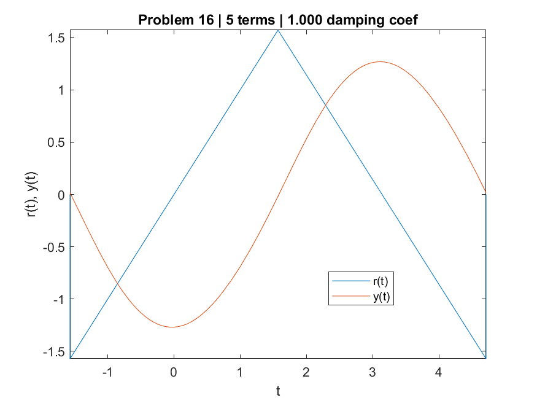
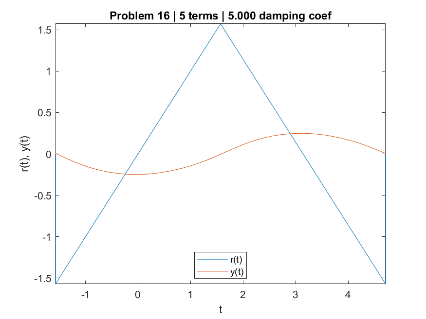

# PDE HW4

**106033233 資工21 周聖諺**

## Matlab Code

```matlab
%{
P92 22.
r(t) = 99cos4.9t
y(t) = -98 * cos5t + 100 * cos4.9t
%}

fn_in1 = @(t) 99 * cos(4.9 * t);
fn_y1 = @(t) -98 * cos(5 * t) + 100 * cos(4.9 * t);
draw(fn_in1, fn_y1, 'Problem 22', 'plot_problem22.png', 0, 3*pi);

%{
P92 24.
y = (1 + 2/pi^2)(1 - cos t) - t^2/pi^2, if 0 <= t <= pi
    -(1 + 4/pi^2)cos t - (2/pi) sin t, if t > pi
%}

fn_in2 = @(t) fn_in24(t);
fn_y2 = @(t) fn_y24(t);
draw(fn_in2, fn_y2, 'Problem 24', 'plot_problem24.png', 0, 3*pi);

%{
P92 25.
r(t) = cos wt
y = 2/(1-w^2) * sin(1/2 * (1 + w) * t) * sin(1/2 * (1 - w) * t)
%}
ws = [0.2 0.9 6];
us = [20*pi 20*pi 10*pi];
for i = 1:length(ws)
    w = ws(i);
    u = us(i);
    fn_in3 = @(t) fn_in25(w, t);
    fn_y3 = @(t) fn_y25(w, t);
    title_str = sprintf('Problem 25 | w=%0.3f', w);
    fig_name_str = sprintf('plot_problem25_w%0.3f_.png', w);
    draw(fn_in3, fn_y3, title_str, fig_name_str, 0, u);
end

%{
P494 15.
r(t) = t(pi^2 - t^2), if -pi < t < pi and r(t+pi) r(t)
y = \sum_{n=1}^{\infty} (-1)^n * (12 * n * c) / (n^3 * D_n) * cos nt + (-1)^(n+1) * (12 * (1 - n^2)) / (n^3 * D_n)
    where D_n = (1 - n^2)^2 + n^2 * c^2
%}
s_num_term = 5; c_damping_coef = 1;
fn_in4 = @(t) fn_in15(t);
fn_y4 = @(t) fn_y15(s_num_term, c_damping_coef, t);
draw(fn_in4, fn_y4, sprintf('Problem 15 | %d terms | %0.3f damping coef', s_num_term, c_damping_coef), 'plot_problem15.png', -pi, pi);

%{
P494 16.
r(t) = t, if -pi/2 < t < pi/2 and r(t+pi) r(t)
       pi - t, if pi/2 < t < 3*pi/2
y = \sum_{n=1}^{\infty} (-1)^n * b_n/D_n * ((1-n^2)sin nt - (n*c)cos nt)
    where D_n = (1 - n^2)^2 + n^2 * c^2, b_n = (-1/2n * cos n*pi/2) + (3/(n^2 * pi) * sin n*pi/2) + (1/2n * cos 3n*pi/2) + (1/(n^2 * pi) * sin 3n*pi/2)
%}
s_num_term = 5; 
c_damping_coefs = [0.5 1 5];
for i = 1:length(c_damping_coefs)
    c_damping_coef = c_damping_coefs(i);
    fn_in5 = @(t) fn_in16(t);
    fn_y5 = @(t) fn_y16(s_num_term, c_damping_coef, t);
    title_str = sprintf('Problem 16 | %d terms | %0.3f damping coef', s_num_term, c_damping_coef);
    fig_name_str = sprintf('plot_problem16_c%0.3f_.png', c_damping_coef);
    draw(fn_in5, fn_y5, title_str, fig_name_str, -pi/2, 3*pi/2);
end

function r_t = fn_in24(t)
    if (t >= 0) && (t <= pi)
        r_t = 1 - ((t^2)/(pi^2));
    elseif t > pi
        r_t = 0;
    else
        r_t = 0;
    end
end

function y_t = fn_y24(t)
    if (t >= 0) && (t <= pi)
        y_t = ((2/(pi^2)) + 1) * (1 - cos(t)) - ((t^2)/(pi^2));
    elseif t > pi
        y_t = (-(4/(pi^2)) + 1) * cos(t) + ((1/pi) * sin(t));
    else
        y_t = 0;
    end
end

function r_t = fn_in25(w, t)
    r_t = cos(w * t);
end

function y_t = fn_y25(w, t)
    y_t = (2/(1 - w^2)) * sin(0.5 * (1 + w) * t) * sin(0.5 * (1 - w) * t);
end

function r_t = fn_in15(t)
    r_t = 0;
    if (t >= -pi) && (t <= pi)
        r_t = t * (pi^2 - t^2);
    end
end

function y_t = fn_y15(s, c, t)
    y_t = 0;
    for n = 1:s
        D_n = (1 - n^2)^2 + n^2 * c^2;
        y_t = y_t + (-1)^n * (12 * n * c) / (n^3 * D_n) * cos(n * t) + (-1)^(n+1) * (12 * (1 - n^2)) / (n^3 * D_n) * sin(n * t);
    end
end

function r_t = fn_in16(t)
    if (t > -pi/2) && (t < pi/2)
        r_t = t;
    elseif (t > pi/2) && (t < 3 * pi/2)
        r_t = pi - t;
    else
        r_t = 0;
    end
end

function y_t = fn_y16(s, c, t)
    y_t = 0;
    for n = 1:s
        b_n = (-1/(2*n) * cos(n*pi/2) + 3/(n^2*pi) * sin(n*pi/2)) + (1/(2*n) * cos(3*n*pi/2) - 1/(n^2*pi) * sin(3*n*pi/2));
        D_n = (1 - n^2)^2 + n^2 * c^2;
        y_t = y_t + (b_n/D_n) * ((1-n^2)*sin(n*t) - n*c*cos(n*t));
    end
end

function draw(fn_rt, fn_yt, title_str, save_path, l, u)
    fn_in = @(t) fn_rt(t);
    fn_y = @(t) fn_yt(t);
    f = figure;
    figure(f);
    fplot(fn_in, [l, u])
    hold on
    fplot(fn_y, [l, u])
    title(title_str)
    ylabel('r(t), y(t)')
    xlabel('t')
    legend({'r(t)','y(t)'},'Location','best')
    saveas(gcf, save_path)
end

```

## P92. Problem 22


## P92. Problem 24


## P92. Problem 25






## P494. Problem 15


## P494. Problem 16




