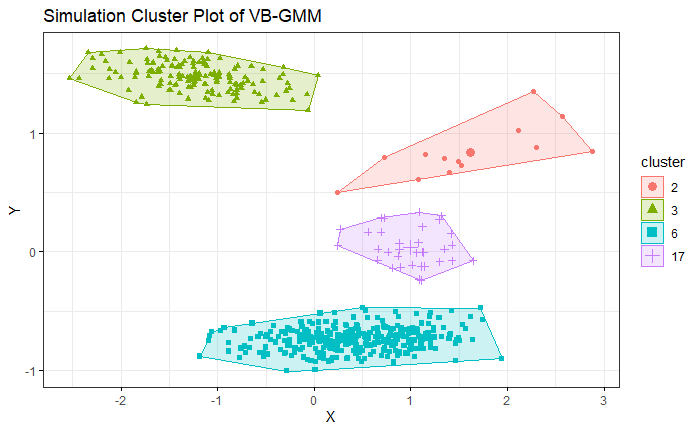

# A Review of Variation Bayesian Gaussian Mixture Model

## 1. Introduction

When we use K-Means or GMM to solve clustering problem, the most important hyperparameter is the number of the cluster. It is quite hard to decide and cause the good/bad performance significantly. In the mean time, K-Means also cannot handle unbalanced dataset well. However, the variational Bayesian Gaussian mixture model(VB-GMM) can solve these. VB-GMM is a Bayesian model that contains priors over the parameters of GMM. Thus, VB-GMM can be optimized by variational expectation maximization(VEM) and find the optimal cluster number automatically. Further, VB-GMM can also deal with the unbalanced dataset well. In this article, we will first derive the general form of the EM algorithm and prove that the EM algorithm approximates the MLE actually. In the section 2, we will introduce the variational lower bound(a.k.a evidence lower bound / VLBO / ELBO), combine EM and ELBO and, derive the variational expectation maximization(VEM). In the section 3, we will take Bayesian GMM as an example and optimize the Bayesian GMM via VEM. In the section 4 and 5, we will conduct a simple simulation to examine the performance of the VB-GMM in comparison to K-Means and apply VB-GMM to the real dataset.

## 2. Expectation Maximization

### 2.1 Naive EM

EM algorithm is useful for the model containing latent variables $Z$ when the maximum likelihood is hard to derive from the observed data $Y$. We can write the maximum likelihood of $Y$ like following

$$
\arg \max_{\theta} \mathcal{L}(Y; \theta) = \arg \max_{\theta} log(p(Y; \theta))
$$

The Expectation Maximization rewrites the question as the following

$$
\arg \max_{\theta} \ log \int_{Z} p(Y, Z; \theta) dZ
$$

Thus, we can derive the EM with an approximation $q(Z; \gamma)$ for $p(Z|Y)$ to avoid evaluating such complex distribution directly

$$
= \arg \max_{\theta} \ log \int_{Z} \frac{q(Z; \gamma)}{q(Z; \gamma)} p(Y, Z; \theta) dZ
$$

$$
= \arg \max_{\theta} \ log \ \mathbb{E}_{q} [\frac{p(Y, Z; \theta)}{q(Z; \gamma)}]
$$

Since the $log$ function is concave, $log(\mathbb{E}_{p}[X]) \geq \mathbb{E}_{p}[log(X)]$ with Jensen's inequality.

$$
\geq \arg \max_{\theta} \ \mathbb{E}_{q} [log(\frac{p(Y, Z; \theta)}{q(Z; \gamma)})]
$$

$$
= \arg \max_{\theta} \ \int_Z q(Z; \gamma) log \ p(Y, Z; \theta) dZ - \int_Z q(Z; \gamma) log \ q(Z; \gamma) dZ
$$

$$
= \arg \max_{\theta} \ \int_Z q(Z; \gamma) log \ p(Y, Z; \theta) dZ - H_q[Z]
$$

Where $H_q[Z]$ is the entropy of $Z$ over distribution $q$

So far, we can express the EM algorithm in a simpler way as

---
Iterate until $\theta$ converge
- E Step
  
  Evaluate $q(Z; \gamma) = p(Z|Y)$
- M Step
  
  $\arg \max_{\theta} \ \int_Z q(Z; \gamma) log \ p(Y, Z; \theta) dZ$
---

### 2.2 EM In General Form

Actually, we can represent the EM algorithm with variational lower bound $\mathcal{L}(\theta, \gamma)$

$$
\mathcal{L}(\theta, \gamma) = \mathbb{E}_{q} [log(\frac{p(Y, Z; \theta)}{q(Z; \gamma)})]
$$

$$
= \int_Z q(Z; \gamma)log \ \frac{p(Y, Z; \theta)}{q(Z; \gamma)} dZ
$$

$$
= - \int_Z q(Z; \gamma)log \ \frac{q(Z; \gamma)}{p(Z|Y)p(Y; \theta)} dZ
$$

$$
= log \ p(Y; \theta) - \int_Z q(Z; \gamma) \ log \ \frac{q(Z; \gamma)}{p(Z|Y)} dZ
$$

$$
= log \ p(Y; \theta) - KL[q(Z; \gamma) || p(Z|Y)] \ \tag{5}
$$

Thus

$$
\max_{\theta} \mathcal{L}(Y; \theta) \geq \arg \max_{\theta, \gamma} \mathcal{L}(\theta, \gamma)
$$

With KKT, the constrained optimization problem can be solve with Lagrange multiplier

$$
\arg \max_{\theta, \gamma} \mathcal{L}(\theta, \gamma) = \arg \max_{\theta, \gamma} log \ p(Y; \theta) - \beta KL[q(Z; \gamma) || p(Z|Y)]
$$

Since we've known the KL-divergence is always greater or equal to 0, when $KL[q(Z; \gamma) || p(Z|Y)] = 0$, the result of EM algorithm will be equal to the maximum likelihood $\mathcal{L}(\theta, \gamma) = \mathcal{L}(Y; \theta)$. In the mean time, minimizing the KL-divergence is actually find the best approximation $q(Z; \gamma)$ for $p(Z|Y)$. 

Thus, we can also represent the EM algorithm as

---
Iterate until $\theta$ converge
- E Step at k-th iteration
  
  $\gamma_{k+1} = \arg \max_{\gamma} \mathcal{L}(\theta_{k}, \gamma_{k})$
- M Step at k-th iteration
  
  $\theta_{k+1} = \arg \max_{\theta} \mathcal{L}(\theta_{k}, \gamma_{k+1})$
---

### 2.3 Variational  Bayesian Expectation Maximization(VEM)

In EM, we approximate a posterior $p(Y, Z; \theta)$ without any prior over the parameters $\theta$. Variational Bayesian Expectation Maximization(VBEM) defines a prior $p(\theta; \lambda)$ over the parameters. Thus, VBEM approximates the bayesian model $p(Y, Z, \theta; \lambda) = p(Y, Z|\theta) p(\theta; \lambda)$. Then, we can define a lower bound on the log marginal likelihood 

$$
log \ p(Y) = log \int_{Z, \theta} p(Y, Z, \theta; \lambda) dZ d\theta
$$

$$
= log \int_{Z, \theta} q(Z, \theta; \phi^{Z}, \phi^{\theta}) \frac{p(Y, Z |\theta) p(\theta; \lambda)}{q(Z, \theta; \phi^{Z}, \phi^{\theta})} dZ d\theta
$$

With mean field theory, we factorize $q$ into a joint distribution $q(Z, \theta; \phi^{Z}, \phi^{\theta}) = q(Z; \phi^{Z}) q(\theta; \phi^{\theta})$. Thus, the equation can be rewritten as

$$
= log \int_{Z, \theta} q(Z; \phi^{Z}) q(\theta; \phi^{\theta}) \frac{p(Y, Z |\theta) p(\theta; \lambda)}{q(Z; \phi^{Z}) q(\theta; \phi^{\theta})} dZ d\theta
$$

$$
= log \ \mathbb{E}_{q(Z; \phi^{Z}) q(\theta; \phi^{\theta})} [\frac{p(Y, Z |\theta) p(\theta; \lambda)}{q(Z; \phi^{Z}) q(\theta; \phi^{\theta})}]
$$

Since the $log$ function is concave, $log(\mathbb{E}_{p}[X]) \geq \mathbb{E}_{p}[log(X)]$ with Jensen's inequality

$$
\geq \mathbb{E}_{q(Z; \phi^{Z}) q(\theta; \phi^{\theta})} [log \  \frac{p(Y, Z |\theta) p(\theta; \lambda)}{q(Z; \phi^{Z}) q(\theta; \phi^{\theta})}]
$$

Thus, we get the ELBO $\mathcal{L}(\phi^{Z}, \phi^{\theta})$

$$
\mathcal{L}(\phi^{Z}, \phi^{\theta}) = \mathbb{E}_{q(Z; \phi^{Z}) q(\theta; \phi^{\theta})} [log \  \frac{p(Y, Z |\theta) p(\theta; \lambda)}{q(Z; \phi^{Z}) q(\theta; \phi^{\theta})}]
$$

Recall that we need to solve $\arg \max_{\phi^{Z}} \mathcal{L}(\phi^{Z}, \phi^{\theta})$ and $\arg \max_{\phi^{\theta}} \mathcal{L}(\phi^{Z}, \phi^{\theta})$ separately in E-step and M-step. Thus, we can derive

$$
\frac{d}{d \phi^{Z}} \mathcal{L}(\phi^{Z}, \phi^{\theta}) = 0
$$

$$
\frac{d}{d \phi^{\theta}} \mathcal{L}(\phi^{Z}, \phi^{\theta}) = 0
$$

Then, we can derive further

$$
\frac{d}{d q(Z; \phi^{Z})} \mathcal{L}(\phi^{Z}, \phi^{\theta}) 
$$

$$
= \frac{d}{d q(Z; \phi^{Z})} \int_{Z, \theta} q(Z; \phi^{Z}) q(\theta; \phi^{\theta}) log \frac{p(Y, Z |\theta) p(\theta; \lambda)}{q(Z; \phi^{Z}) q(\theta; \phi^{\theta})} dZ d\theta 
$$

$$
= \int_{Z, \theta} q(\theta; \phi^{\theta}) log \ p(Y, Z |\theta) p(\theta; \lambda) dZ d\theta - \int_{Z, \theta} q(\theta; \phi^{\theta}) log \ q(\theta; \phi^{\theta}) dZ d\theta
$$

$$
- \int_{Z, \theta} q(\theta; \phi^{\theta}) log \ q(Z; \phi^{Z}) dZ d\theta - \int_{Z, \theta} q(Z; \phi^{Z}) q(\theta; \phi^{\theta}) \frac{1}{q(Z; \phi^{Z})} dZ d\theta
$$

$$
= \mathbb{E}_{q(\theta; \phi^{\theta})} [log \ p(Y, Z |\theta) + log \ p(\theta; \lambda) - log \ q(\theta; \phi^{\theta}) - \mathbb{E}_{q(Z; \phi^{Z})}[log \ q(Z; \phi^{Z})] - 1]
$$

$$
- \frac{d}{d q(Z; \phi^{Z})} \int_{Z, \theta} q(Z; \phi^{Z}) q(\theta; \phi^{\theta}) log \ q(Z; \phi^{Z}) dZ d\theta
$$

**Variational Bayesian EM Algorithm**

---
Iterate until $\mathcal{L}(\phi^Z, \phi^{\theta})$ converge
- E Step: Update the variational distribution on $Z$
  
  $q(Z; \phi^{Z}) \propto e^{(\mathbb{E}_{q(\theta; \phi^{\theta})} [log \ p(Y, Z, \theta)])}$
- M Step: Update the variational distribution on $\theta$
  
  $q(\theta; \phi^{\theta}) \propto e^{(\mathbb{E}_{q(Z; \phi^{Z})} [log \ p(Y, Z, \theta)])}$
---

## 3. Variational Bayesian Gaussian Mixture Model(VB-GMM)

### 3.1 Graphical Model

**Gaussian Mixture Model & Clustering**

The variational Bayesian Gaussian mixture model(VB-GMM) can be represented as the above graphical model. We see each data point as a Gaussian mixture distribution with $K$ components. We also denote the number of data points as $N$. Each $x_n$ is a Gaussian mixture distribution with a weight $\pi_n$ corresponds to a data point. $z_n$ is an one-hot latent variable that indicates which cluster(component) does the data point belongs to. Finally, A component $k$ follows the Gaussian distribution with mean $\mu_k$ and covariance matrix $\Lambda_k$. $\Lambda = \{ \Lambda_1, ..., \Lambda_K \}$ and $\mu = \{ \mu_1, ..., \mu_K \}$ are vectors denote the parameters of Gaussian mixture distribution.

Thus, the joint distribution of the VB-GMM is

$$
p(X, Z, \pi, \mu, \Lambda) = p(X | Z, \pi, \mu, \Lambda) p(Z | \pi) p(\pi) p(\mu | \Lambda) p(\Lambda)
$$

$p(X | Z, \pi, \mu, \Lambda)$ denotes the Gaussian mixture model given on the latent variables and parameters. $p(Z | \pi)$ denotes the latent variables. As for priors, $p(\pi)$ denotes the prior distribution on the latent variables $Z$ and $p(\mu | \Lambda) p(\Lambda)$ denotes the priors distribution on the Gaussian distribution $X$. 

### 3.2 Gaussian Mixture Model

Suppose each data point $x_n \in \mathbb{R}^D$ has dimension $D$. We define the latent variables $Z = \{ z_1, ..., z_N \}, Z \in \mathbb{R}^{N \times K}$, where $z_i =\{z_{i1}, ..., z_{iK} \}, z_i \in \mathbb{R}^K, z_{ij} \in \{ 0, 1\}$. Each $z_{i}$ is a vector containing k binary variables. $z_i$ can be seen as an one-hot encoding that indicates which cluster belongs to. As for $\pi \in \mathbb{R}^K$, $\pi$ is the weight of the Gaussian mixture model of each component.

$$
p(Z | \pi) = \prod_{n=1}^{N}\prod_{k=1}^{K}\pi_{k}^{z_{nk}}
$$

Then, we define the components of the Gaussian mixture model. Each component follows Gaussian distribution and is parametrized by the mean $\mu_k$ and covariance matrix $\Lambda_k^{-1}$. Thus, the conditional distribution of the observed data $X \in \mathbb{R}^{N \times D}$, given the variables $Z, \mu, \Lambda$ is

$$
p(X | Z, \mu, \Lambda) = \prod_{n=1}^{N} \prod_{k=1}^{K} \mathcal{N}(x_{n} | \mu_{k}, \Lambda_{k}^{-1})^{z_{nk}}
$$

where data $X$ contains $N$ data points and $D$ dimensions, parameter $\mu \in \mathbb{R}^K, \mu = \{ \mu_1, ..., \mu_K \}$ and $\Lambda \in \mathbb{R}^{K \times D \times D}, \Lambda_k \in \mathbb{R}^{D \times D}, \Lambda = \{ \Lambda_1, ..., \Lambda_K \}$ are the mean  and the covariance matrix of each component of Gaussian mixture model.

### 3.3 Dirichlet Distribution

Next, we introduce another prior over the parameters. We choose the symmetric Dirichlet distribution over the mixing proportions $\pi$. Support $x_1, ..., x_K$ where $x_i \in (0, 1)$ and $\sum^K_{i=1} x_i = 1, K > 2$ with parameters $\alpha_1, ..., \alpha_K > 0$

$$
X \sim \mathcal{Dir}(\alpha) = \frac{1}{B(\alpha)} \prod^K_{i=1} x^{\alpha_i - 1}_{i}
$$

where the Beta function $B(\alpha)=\frac{\prod^K_{i=1} \Gamma(\alpha_i)}{\Gamma(\sum^K_{i=1} \alpha_i)}$ and $\alpha$ and $X$ are a set of random variables that $\alpha = \{ \alpha_1, ..., \alpha_K\}$ and $X = \{ X_1, ..., X_K\}$. Note that $x_i$ is a sample value generated by $X_i$.

**Expectation**

The mean of the Dirichlet distribution is

$$
E[X_i] = \frac{\alpha_i}{\sum^K_{k=1} \alpha_k}
$$

$$
E[ln \ X_i] = \psi(\alpha_i) - \psi(\sum^K_{k=1} \alpha_k)
$$

where $\psi$ is **digamma** function 

$$
\psi(x) = \frac{d}{dx} ln(\Gamma(x)) = \frac{\Gamma'(x)}{\Gamma(x)} \approx ln(x) - \frac{1}{2x}
$$

**Symmetric Dirichlet distribution**

In order to reduce the number of initial parameters, we use **Symmetric Dirichlet distribution** which is a  special form of Dirichlet distribution that defined as the following

$$
X \sim \mathcal{SymmDir}(\alpha_0) = \frac{\Gamma(\alpha_0 K)}{\Gamma(\alpha_0)^K} \prod^K_{i=1} x^{\alpha_0-1}_i = f(x_1, ..., x_{K-1}; \alpha_0)
$$
where $X = \{ X_1, ..., X_{K-1} \}$. The $\alpha$ parameter of the symmetric Dirichlet is a scalar which means all the elements $\alpha_i$ of the $\alpha$ are the same $\alpha = \{ \alpha_0, ..., \alpha_0 \}$. 

**With Gaussian Mixture Model**

Thus, we can model the distribution of the weights of Gaussian mixture model as a symmetric Dirichlet distribution.

$$
p(\pi) = \mathcal{Dir}(\pi | \alpha_0) = \frac{1}{B(\alpha_0)} \prod^K_{k=1} \pi^{\alpha_0 - 1}_{k} = C(\alpha_0) \prod^K_{k=1} \pi^{\alpha_0 - 1}_{k}
$$

### 3.4 Gaussian-Wishart Distribution

If a normal distribution whose parameters follow the Wishart distribution. It is called **Gaussian-Wishart distribution**. Support $\mu \in \mathbb{R}^D$ and $\Lambda \in \mathbb{R}^{D \times D}$, they are generated from Gaussian-Wishart distribution which is defined as

$$
(\mu, \Lambda) \sim \mathcal{NW}(m_0, \beta_0, W_0, \nu_0) = \mathcal{N}(\mu | m_0, (\beta_0 \Lambda)^{-1} )\mathcal{W}(\Lambda | W_0, \nu_0)
$$

where $m_0 \in \mathbb{R}^D$ is the location, $W \in \mathbb{R}^{D \times D}$ represent the scale matrix, $\beta_0 \in \mathbb{R}, \beta_0 > 0$, and $\nu \in \mathbb{R}, \nu > D - 1$.

**Posterior**

After making $n$ observations $\{ x_1, ..., x_n \}$ with mean $\bar{x} = \frac{1}{n} \sum_{i=1}^{n} x_i$, the posterior distribution of the parameters is

$$
(\mu, \Lambda) \sim \mathcal{NW}(m_n, \beta_n, W_n, \nu_n)
$$

where

$$
\beta_n = \beta_0 + n
$$

$$
m_n = \frac{\beta_0 m_0 + n \bar{x}}{\beta_0 + n}
$$

$$
\nu_n = \nu_0 + n
$$

$$
W^{-1}_n = W^{-1}_0 + \sum_{i=1}^{n} (x_i - \bar{x}) (x_i - \bar{x})^{\top} + \frac{n \beta_0}{n + \beta_0} (\bar{x} - m_0) (\bar{x} - m_0)^{\top}
$$

**With Gaussian Mixture Model**

We define the Gaussian mixture model with Gaussian-Wishart prior. 

$$
p(\mu, \Lambda) = p(\mu | \Lambda) p(\Lambda) = \prod^K_{k=1} \mathcal{N}(\mu_k | m_0, (\beta_0 \Lambda_k)^{-1}) \mathcal{W}(\Lambda_k | W_0, \nu_0)
$$

### 3.5 The Algorithm

**E-Step**

E-Step aims to update the variational distribution on latent variables $Z$

$$
ln \ q(Z; \phi^{Z}) \propto \mathbb{E}_{q(\theta; \phi^{\theta})} [log \ p(Y, Z, \theta)]
$$

Thus, we can derive

$$
ln\ q(Z) \propto \mathbb{E}_{\pi, \mu, \Lambda} [\text{ln}\;p(X, Z, \pi, \mu, \Lambda)]
$$

$$
= \mathbb{E}_{\pi} [ln \ p(Z | \pi)] + \mathbb{E}_{\mu, \Lambda}[ln \ p(X | Z, \mu, \Lambda)] + \mathbb{E}_{\pi, \mu, \Lambda}[ln \ p(\pi, \mu, \Lambda)]
$$

$$
= \mathbb{E}_{\pi} [ln \ p(Z | \pi)] + \mathbb{E}_{\mu, \Lambda}[ln \ p(X | Z, \mu, \Lambda)] + C
$$

where $C$ is a constant, 

$$
\mathbb{E}_{\pi} [ln \ p(Z | \pi)] = \mathbb{E}_{\pi} \Big[ ln \ \prod_{n=1}^{N}\prod_{k=1}^{K}\pi_{k}^{z_{nk}} \Big]
$$

$$
= \mathbb{E}_{\pi} \Big[ \sum_{n=1}^{N}\sum_{k=1}^{K} z_{nk} \ ln \ \pi_{k} \Big]
$$

$$
= \sum_{n=1}^{N}\sum_{k=1}^{K} z_{nk} \ \mathbb{E}_{\pi} [ln \ \pi_{k}]
$$

and

$$
\mathbb{E}_{\mu, \Lambda}[ln \ p(X | Z, \mu, \Lambda)] = \mathbb{E}_{\mu, \Lambda} \Big[ ln \ \prod_{n=1}^{N} \prod_{k=1}^{K} \mathcal{N}(x_{n} | \mu_{k}, \Lambda_{k}^{-1})^{z_{nk}} \Big]
$$

$$
= \sum_{n=1}^{N} \sum_{k=1}^{K} z_{nk} \ \mathbb{E}_{\mu_k, \Lambda_k} \Big[ ln \ \frac{e^{-\frac{1}{2} (x_n - \mu_k)^{\top} \Lambda (x_n - \mu_k)}}{\sqrt{(2 \pi)^D det(\Lambda_k^{-1})}} \Big]
$$

$$
= \sum_{n=1}^{N} \sum_{k=1}^{K} z_{nk} \ \mathbb{E}_{\mu_k, \Lambda_k} \Big[ -\frac{1}{2} (x_n - \mu_k)^{\top} \Lambda (x_n - \mu_k) - \frac{1}{2} ln ((2 \pi)^D det(\Lambda_k^{-1})) \Big]
$$

$$
= \sum_{n=1}^{N} \sum_{k=1}^{K} z_{nk} \Big( -\frac{1}{2}\mathbb{E}_{\mu_k, \Lambda_k} \Big[ (x_n - \mu_k)^{\top} \Lambda (x_n - \mu_k) \Big] - \frac{D}{2} ln \ 2 \pi + \mathbb{E}_{\Lambda_k} \Big[ ln \ det(\Lambda_k) \Big] \Big)
$$

Due to simplification, let 

$$
ln \ \rho_{nk} = \mathbb{E}_{\pi} [ln \ \pi_{k}] - \frac{1}{2}\mathbb{E}_{\mu_k, \Lambda_k} \Big[ (x_n - \mu_k)^{\top} \Lambda (x_n - \mu_k) \Big] - \frac{D}{2} ln \ 2 \pi + \mathbb{E}_{\Lambda_k} \Big[ ln \ det(\Lambda_k) \Big]
$$

Thus, 

$$
ln\ q(Z) \propto \sum_{n=1}^{N}\sum_{k=1}^{K} z_{nk} ln \ \rho_{nk}
$$

In order to normalize the factor of $\rho_{nk}$, we divide the $\rho_{nk}$ by $\sum_{j=1}^K \rho_{nj}$ and obtain the $r_{nk}$.

$$
ln\ q(Z) \propto \sum_{n=1}^{N}\sum_{k=1}^{K} z_{nk} ln \ r_{nk}, \text{where} \ r_{nk} = \frac{\rho_{nk}}{\sum_{j=1}^K \rho_{nj}}
$$

Note that since each data point only belongs to one cluster and $z_{nk}$ is an indicator variable(if data point $i$ belongs to cluster $k$, $z_{ik} = 1$. Otherwise, $z_{ik} = 0$), thus, $\frac{1}{K} \sum_{j=1}^K z_{nj} = \frac{1}{K}$. Therefore, $z_{nk}$ can be seen as a kind of probability that represents how possible does the $n$-th data point belongs to $k$-th cluster. We aims to optimize the expectation $\mathbb{E}[z_{nk}] = 1$, when the $n$-th data point belongs to $k$-th cluster.

$$
\mathbb{E}_{z_{nk}} [z_{nk}] = r_{nk}
$$

For convenience, we also define some useful variables.

$$
N_k = \sum_{n=1}^N r_{nk}, \quad \bar{x}_k = \frac{1}{N_k} \sum_{n=1}^N r_{nk} x_n, \quad S_k = \frac{1}{N_k} r_{nk} (x_n - \bar{x}_k) (x_n - \bar{x}_k)^{\top}
$$

**M-Step**

E-Step aims to update the variational distribution on variables $\theta$

$$
ln \ q(\theta; \phi^{\theta}) \propto \mathbb{E}_{q(Z; \phi^{Z})} [log \ p(Y, Z, \theta)]
$$

Thus, we can derive

$$
ln\ q(\pi, \mu, \Lambda) \propto \mathbb{E}_{Z} [ln \ p(X, Z, \pi, \mu, \Lambda)]
$$

$$
= \mathbb{E}_{Z} [ln \ p(X | Z, \pi, \mu, \Lambda)] + \mathbb{E}_{Z} [ln \ p(Z | \pi)] + \mathbb{E}_{Z} [ln \ p(\pi)] + \mathbb{E}_{Z} [ln \ p(\mu, \Lambda)]
$$

We assume the joint distribution of parameters follows **mean field theorem** such that the parameters of each component are independent $q(\pi, \mu, \Lambda) = q(\pi) \prod_{i=1}^N q(\mu_i, \Lambda_i)$. With it, the problem would be easier to solve.

**The Posterior of Dirichlet Distribution**

$$
\mathbb{E}_{Z} [ln \ q(Z | \pi)] + \mathbb{E}_{Z} [ln \ q(\pi)]
$$

$$
= \mathbb{E}_Z \Big[ ln \ \frac{1}{B(\alpha_0)} \prod^K_{k=1} \pi^{\alpha_0 - 1}_{k} + ln \ \prod_{n=1}^{N}\prod_{k=1}^{K}\pi_{k}^{z_{nk}} \Big]
$$

$$
= \mathbb{E}_Z \Big[ -ln \ B(\alpha_0) + \sum^K_{k=1} (\alpha_0 - 1) ln \ \pi_{k} + \sum_{n=1}^{N}\sum_{k=1}^{K} z_{nk} ln \ \pi_{k} \Big]
$$

$$
= -ln \ B(\alpha_0) + \sum^K_{k=1} (\alpha_0 - 1) ln \ \pi_{k} + \sum_{n=1}^{N}\sum_{k=1}^{K} \mathbb{E}_Z [z_{nk}] ln \ \pi_{k}
$$

In order to evaluate the posterior distribution with observed data points $\{ x_1, ..., x_N \}$ and the result of E-step, replace the $\mathbb{E}_Z [z_{nk}]$ with $r_{nk}$.

$$
= -ln \ B(\alpha_0) + \sum^K_{k=1} (\alpha_0 - 1) ln \ \pi_{k} + \sum_{k=1}^{K} \sum_{n=1}^{N} r_{nk} ln \ \pi_{k}
$$

$$
= -ln \ B(\alpha_0) + \sum^K_{k=1} (\alpha_0 - 1) ln \ \pi_{k} + \sum_{k=1}^{K} \Big( ln \ (\pi_{k}) \sum_{n=1}^{N} r_{nk} \Big)
$$

$$
= -ln \ B(\alpha_0) + \sum_{k=1}^{K} (\alpha_0 + N_k - 1) ln \ \pi_{k}
$$

Since the posterior distribution of Dirichlet is also Dirichlet, thus we can derive

$$
= ln \ \frac{1}{B(\alpha)} \prod_{k=1}^{K} \pi_{k}^{(\alpha_0 + N_k - 1)}
$$

$$
= ln \ \mathcal{Dir}(\pi | \alpha)
$$

where $\alpha \in \mathbb{R}^K, \ \alpha = \{ \alpha_1, ..., \alpha_K \}, \ \alpha_k = \alpha_0 + N_k$ is the parameter of the Dirichlet distribution.

**The Posterior of Gaussian-Wishart Distribution**

The posterior distribution parametrized by $m_k, \beta_k, W_k, \nu_k$ is

$$
\mathbb{E}_{Z} [ln \ q(\mu, \Lambda)] = \mathbb{E}_{Z}\Big[ ln \ \prod^K_{k=1} \mathcal{N}(\mu_k | m_k, (\beta_k \Lambda_k)^{-1}) \mathcal{W}(\Lambda_k | W_k, \nu_k) \Big]
$$

where the parameters of the prior $\lambda$ we've given before.

$$
\beta_k = \beta_0 + N_k
$$

$$
m_k = \frac{\beta_0 m_0 + N_k \bar{x}_k}{\beta_k}
$$

$$
\nu_k = \nu + N_k + 1
$$

$$
W^{-1}_k = W^{-1}_0 + N_k S_k + \frac{N_k \beta_0}{N_k + \beta_0} (\bar{x}_k - m_0) (\bar{x}_k - m_0)^{\top}
$$

So far, we've derive the parameters of the prior of the bayesian model. Let's move on to the next iteration of VBEM. 

In order to conduct the E-step in the next iteration, we need the parameters of Gaussian mixture model which is denoted by $\theta$. We denote the parameters of Gaussian mixture as $\pi^*, \Lambda^*$

$$
ln \ \pi_k^* = \mathbb{E}[ln \ \pi_k] = \psi(\alpha_k) - \psi \Big(\sum_{k=1}^K \alpha_k \Big)
$$

$$
ln \ \Lambda_k^* = \mathbb{E}[ln \ det(\Lambda_k)] = \sum_{d=1}^{D} \psi \Big( \frac{\nu_{k} + 1 - d}{2} \Big) + D \ ln 2 + ln \ det(W_k)
$$

**Predict Probability Density**

The probability dense function of the VB-GMM is a sum of Student-t distribution. We can derive the PDF from the joint distribution.

$$
q(x^* | X) = \sum_{z^*} \int_{\pi} \int_{\mu} \int_{\Lambda} q(x^*| z^*, \mu, \Lambda) q(z^* | \pi) q(\pi, \mu, \Lambda | X)
$$

$$
= \sum_{z^*} \int_{\pi} \int_{\mu} \int_{\Lambda} \pi_ q(z^* | \pi) q(\pi, \mu, \Lambda | X)
$$

$$
= \frac{1}{\alpha^*} \sum_{k=1}^K \alpha_k \mathcal{St}(x^* | m_k, \frac{(\nu_k + 1 - D) \beta_k}{1 + \beta_k} W_k, \nu_k + 1 - D)
$$

**VB-GMM Pseudo Code**

---

Repeat until ELBO converge or reach the limit of iteration

E Step

  - Compute $ln \ \rho_{nk} = \mathbb{E}_{\pi} [ln \ \pi_{k}] - \frac{1}{2}\mathbb{E}_{\mu_k, \Lambda_k} \Big[ (x_n - \mu_k)^{\top} \Lambda (x_n - \mu_k) \Big] - \frac{D}{2} ln \ 2 \pi + \mathbb{E}_{\Lambda_k} \Big[ ln \ det(\Lambda_k) \Big]$ where $1 \leq n \leq N$ and $1 \leq k <K$

  - Compute $ln \ r_{nk} = LogSumExp(ln \ \rho_{nk})$
   
  - Compute $r_{nk} = e^{(ln \ \rho_{nk})}$

  - Compute $N_k = \sum_{n=1}^N r_{nk}$

  - Compute $\bar{x}_k = \frac{1}{N_k} \sum_{n=1}^N r_{nk} x_n$
  
  - Compute $S_k = \frac{1}{N_k} r_{nk} (x_n - \bar{x}_k) (x_n - \bar{x}_k)^{\top}$

M Step

  Update Dirichlet distribution

  - Compute $\alpha_k = \alpha_0 + N_k, \ for \ 1 \leq k \leq K$

  Update Gaussian Mixture distribution

  - Compute $ln \ \pi_k^* = \mathbb{E}[ln \ \pi_k] = \psi(\alpha_k) - \psi \Big(\sum_{k=1}^K \alpha_k \Big)$

  Update Gaussian-Wishart distribution

  - Compute $\beta_k = \beta_0 + N_k, \ for \ 1 \leq k \leq K$
  
  - Compute $m_k = \frac{\beta_0 m_0 + N_k \bar{x}_k}{\beta_k}, \ for \ 1 \leq k \leq K$
  
  - Compute $\nu_k = \nu + N_k + 1, \ for \ 1 \leq k \leq K$
  
  - Compute $W^{-1}_k = W^{-1}_0 + N_k S_k + \frac{N_k \beta_0}{N_k + \beta_0} (\bar{x}_k - m_0) (\bar{x}_k - m_0)^{\top}, \ for \ 1 \leq k \leq K$
  
  - Compute $$

---

## 4. Simulation

We generate a bivariate Gaussian mixture distribution with 5 modals. We use K-means which is given 5 clusters as parameter. VB-GMM out-perform than K-means while clustering unbalanced dataset. Even though the K-mean already has correct hyperparameters. 

VB-GMM not only deals with unbalanced dataset well but also self-adapts to the best number of clusters.

**K-means**

**VB-GMM**

With the animation, we can see the number of clusters of VB-GMM keep reducing until it find a best fit to the dataset.

## 5. Examine on Real Dataset

