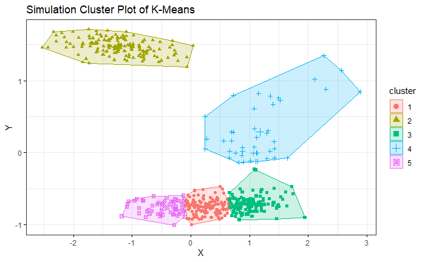
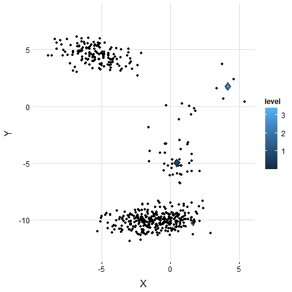
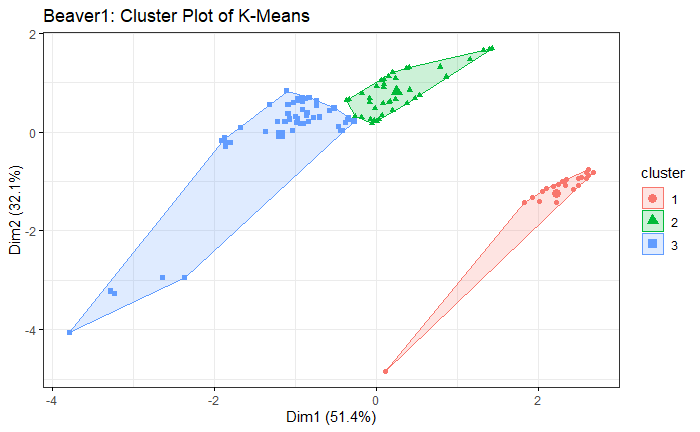
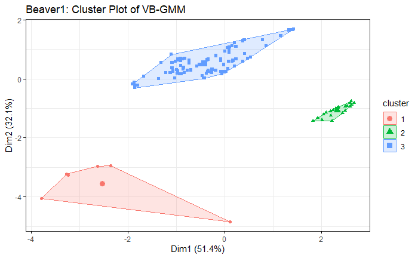
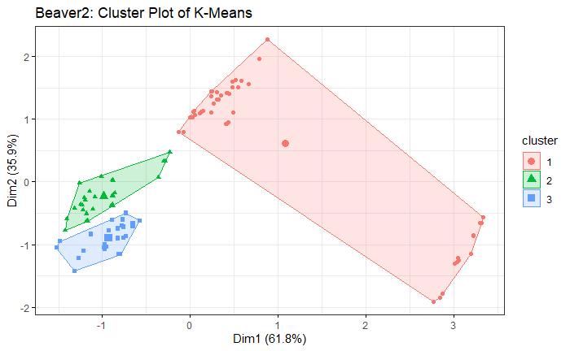
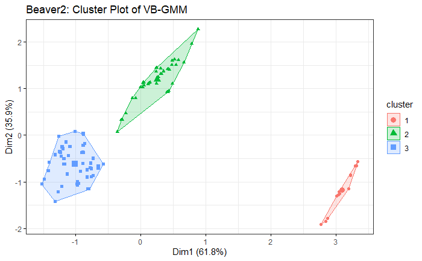

# A Review of Variation Bayesian Gaussian Mixture Model

資工21 106033233 周聖諺

---

## Introduction

**The disadvantage of K-Means**

- Hard to **decide the number of clusters**
  
- **Poor** performance on **unbalanced dataset**

**Variational Bayesian Expectation Maximization(VBEM)**

- Only need to choose the **maximum number of clusters, self-adapt to the best**

- **Better** performance on unbalanced dataset

---

<!-- ## Naive EM

**Pseudo Code**

Iterate until $\theta$ converge
- E Step
  
  Evaluate $q(Z; \gamma) = p(Z|Y)$
- M Step
  
  $\arg \max_{\theta} \ \int_Z q(Z; \gamma) log \ p(Y, Z; \theta) dZ$

--- -->

## EM In General Form

In naive EM, the goal is to **maximize likelihood $\mathcal{L}(Y; \theta)$**

$$
\arg \max_{\theta} \mathcal{L}(Y; \theta) = \arg \max_{\theta} \ log \int_{Z} p(Y, Z; \theta) dZ
$$

where **$Y$ is observing data, $Z$ is latent variable, $\theta$ is the parameter**

With ELBO, we can derive the **lower bound $\mathcal{L}(\theta, \gamma)$ of likelihood $\mathcal{L}(Y; \theta)$**

$$
\mathcal{L}(\theta, \gamma) = \mathbb{E}_{q} [log(\frac{p(Y, Z; \theta)}{q(Z; \gamma)})]
$$

$$
= \int_Z q(Z; \gamma)log \ \frac{p(Y, Z; \theta)}{q(Z; \gamma)} dZ
$$

$$
= log \ p(Y; \theta) - KL[q(Z; \gamma) || p(Z|Y)]
$$

$$
= \mathcal{L}(Y; \theta) - KL[q(Z; \gamma) || p(Z|Y)]
$$

---

## EM In General Form

Thus

$$
\mathcal{L}(\theta, \gamma) = \mathcal{L}(Y; \theta) - KL[q(Z; \gamma) || p(Z|Y)]
$$

Since the KL-divergence always $\geq 0$

$$
\arg \max_{\theta} \mathcal{L}(Y; \theta) \geq \arg \max_{\theta, \gamma} \mathcal{L}(\theta, \gamma)
$$

With KKT and Lagrange multiplier, the optimization problem can be written as

$$
\arg \max_{\theta, \gamma} \mathcal{L}(\theta, \gamma) = \arg \max_{\theta, \gamma} \mathcal{L}(Y; \theta) - \beta KL[q(Z; \gamma) || p(Z|Y)]
$$

---

## EM In General Form

**Pseudo Code**

Iterate until $\theta$ converge
- E Step at k-th iteration
  
  $\gamma_{k+1} = \arg \max_{\gamma_k} \mathcal{L}(\theta_{k}, \gamma_{k})$
- M Step at k-th iteration
  
  $\theta_{k+1} = \arg \max_{\theta_k} \mathcal{L}(\theta_{k}, \gamma_{k+1})$

---

## Variational Bayesian Expectation Maximization(VBEM)

In VBEM, we consider an **additional prior $p(\theta; \lambda)$**

$$
log \ p(Y) = log \int_{Z, \theta} p(Y, Z, \theta; \lambda) dZ d\theta
$$

$$
= log \ \mathbb{E}_{q(Z; \phi^{Z}) q(\theta; \phi^{\theta})} [\frac{p(Y, Z |\theta) p(\theta; \lambda)}{q(Z; \phi^{Z}) q(\theta; \phi^{\theta})}]
$$

$$
\geq \mathbb{E}_{q(Z; \phi^{Z}) q(\theta; \phi^{\theta})} [log \  \frac{p(Y, Z |\theta) p(\theta; \lambda)}{q(Z; \phi^{Z}) q(\theta; \phi^{\theta})}]
$$

Thus, we get the ELBO $\mathcal{L}(\phi^{Z}, \phi^{\theta})$

$$
\mathcal{L}(\phi^{Z}, \phi^{\theta}) = \mathbb{E}_{q(Z; \phi^{Z}) q(\theta; \phi^{\theta})} [log \  \frac{p(Y, Z |\theta) p(\theta; \lambda)}{q(Z; \phi^{Z}) q(\theta; \phi^{\theta})}]
$$

---

## Variational Bayesian Expectation Maximization(VBEM)

According to the general form of EM

$$
\arg \max_{\gamma_k} \mathcal{L}(\theta_{k}, \gamma_{k})
$$

$$
\arg \max_{\theta_k} \mathcal{L}(\theta_{k}, \gamma_{k})
$$

We can derive

$$
\frac{d}{d \phi^{Z}} \mathcal{L}(\phi^{Z}, \phi^{\theta}) = 0, \quad ln \ q(Z; \phi^{Z}) \propto \mathbb{E}_{q(\theta; \phi^{\theta})} [log \ p(Y, Z, \theta)]
$$

$$
\frac{d}{d \phi^{\theta}} \mathcal{L}(\phi^{Z}, \phi^{\theta}) = 0, \quad ln \ q(\theta; \phi^{\theta}) \propto \mathbb{E}_{q(Z; \phi^{Z})} [log \ p(Y, Z, \theta)]
$$

---

## Variational Bayesian Expectation Maximization(VBEM)

**Pseudo Code**

Iterate until $\mathcal{L}(\phi^Z, \phi^{\theta})$ converge
- E Step: Update the variational distribution on $Z$
  
  $q(Z; \phi^{Z}) \propto e^{(\mathbb{E}_{q(\theta; \phi^{\theta})} [log \ p(Y, Z, \theta)])}$

- M Step: Update the variational distribution on $\theta$
  
  $q(\theta; \phi^{\theta}) \propto e^{(\mathbb{E}_{q(Z; \phi^{Z})} [log \ p(Y, Z, \theta)])}$

---

## Variational Bayesian Gaussian Mixture Model(VB-GMM)

$$
p(X, Z, \pi, \mu, \Lambda) = p(X | Z, \pi, \mu, \Lambda) p(Z | \pi) p(\pi) p(\mu | \Lambda) p(\Lambda)
$$

- $p(X | Z, \pi, \mu, \Lambda)$ denotes the **Gaussian Mixture Model**

- $p(Z | \pi)$ denotes the **Latent Variables**

- $p(\pi)$ denotes the **Dirichlet Prior Distribution Over The Latent Variables $Z$** 

- $p(\mu | \Lambda) p(\Lambda)$ denotes the **Gaussian-Wishart Prior Distribution Over GMM $X$**

---

# Ignore The Complex Derivation
---

## K-means Cluster Plot

**Fit On 5 Modal Simulation Dataset Generated by GMM**

<!--  -->
<!--  -->

---

## VB-GMM Cluster Plot

**Fit On 5 Modal Simulation Dataset Generated by GMM**

---

## VB-GMM Contour Plot Animation

**Fit On 5 Modal Simulation dataset**

[Link](https://github.com/FrankCCCCC/math_new/blob/master/statistical_computing/Mid/simulate/animate.gif)

---

## K-means Cluster Plot

**Fit On Beaver1 dataset**

---

## VB-GMM Cluster Plot

**Fit On Beaver1 dataset**

---

## K-means Cluster Plot

**Fit On Beaver2 dataset**

---

## VB-GMM Cluster Plot

**Fit On Beaver2 dataset**

---

# Thanks For Listening