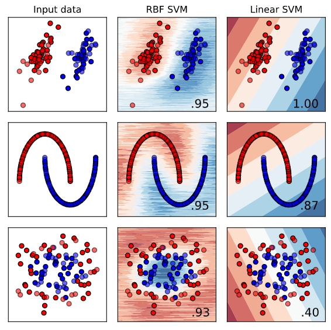

# From SVM to SMO and Random Feature Kernel Approximation

106033233 資工21 周聖諺
---

## Abstract

## Lagrange Multiplier

## Karush, Kuhn, Tucker(KKT) Condition

## Hard-Margin SVM

## Soft-Margin SVM

## Kernel Trick

## Sequential Minimal Optimization(SMO)

Based on the paper **Sequential Minimal Optimization: A Fast Algorithm for Training Support Vector Machines**.

We've known he dual problem of soft-SVM is

$$
\sup_{\alpha} \sum_{i=1}^{N} \alpha_i - \frac{1}{2} \sum_{i=1}^{N} \sum_{j=1}^{N} \alpha_i \alpha_j y_i y_j k(x_i, x_j) \\

\text{subject to} \  0 \leq \alpha_i \leq C, \sum_{i=1}^{N} \alpha_i y_i= 0
$$

We also define the kernel.

$$
k(x_i, x_j) = \langle \phi(x_i), \phi(x_j) \rangle
$$

where $\phi$ is an embedding function projecting the data points to a high dimensional space.

However, it's very hard to solve because we need to optimize $N$ variables. 

### Notation

We denote the target function as $\mathcal{L}_d(\alpha, C)$

$$
\mathcal{L}_d(\alpha) = \sum_{i=1}^{N} \alpha_i - \frac{1}{2} \sum_{i=1}^{N} \sum_{j=1}^{N} \alpha_i \alpha_j y_i y_j k(x_i, x_j)
$$

We also denote the kernel of $x_1, x_2$ as $K_{1, 2} = k(x_1, x_2)$.

### Step 1. Update 2 Variable

First, we need to pick 2 variables to update in sequence, so we split the variables $\alpha_1, \alpha_2$ from the summation. 

$$
\mathcal{L}_d(\alpha) = 
\alpha_1 + \alpha_2 - 
\frac{1}{2} \alpha_1^2 y_1^2 K_{1,1} - \frac{1}{2} \alpha_2^2 y_2^2 K_{2,2} \\

- \frac{1}{2} \alpha_1 \alpha_2 y_1 y_2 K_{1, 2} - \frac{1}{2} \alpha_2 \alpha_1 y_2 y_1 K_{2, 1}\\

- \frac{1}{2} \alpha_1 y_1 \sum_{i=3}^{N} \alpha_i y_i K_{i,1} - \frac{1}{2} \alpha_1 y_1 \sum_{i=3}^{N} \alpha_i y_i K_{1, i} \\

- \frac{1}{2} \alpha_2 y_2 \sum_{i=3}^{N} \alpha_i y_i K_{i,2} - \frac{1}{2} \alpha_2 y_2 \sum_{i=3}^{N} \alpha_i y_i K_{2, i} \\

+ \sum_{i=3}^{N} \alpha_i - \frac{1}{2} \sum_{i=3}^{N} \sum_{j=3}^{N} \alpha_i \alpha_j y_i y_j k(x_i, x_j)
$$

$$
= \alpha_1 + \alpha_2 - 
\frac{1}{2} \alpha_1^2 y_1^2 K_{1,1} - \frac{1}{2} \alpha_2^2 y_2^2 K_{2,2} - \alpha_1 \alpha_2 y_1 y_2 K_{1, 2}\\

- \alpha_1 y_1 \sum_{i=3}^{N} \alpha_i y_i K_{i,1} - \alpha_2 y_2 \sum_{i=3}^{N} \alpha_i y_i K_{i,2} + \mathcal{Const}
$$

$$
= \alpha_1 + \alpha_2 - 
\frac{1}{2} \alpha_1^2 K_{1,1} - \frac{1}{2} \alpha_2^2 K_{2,2} - \alpha_1 \alpha_2 y_1 y_2 K_{1, 2}\\

- \alpha_1 y_1 \sum_{i=3}^{N} \alpha_i y_i K_{i,1} - \alpha_2 y_2 \sum_{i=3}^{N} \alpha_i y_i K_{i,2} + \mathcal{Const}
$$

where $\mathcal{Const} = \sum_{i=3}^{N} \alpha_i - \frac{1}{2} \sum_{i=3}^{N} \sum_{j=3}^{N} \alpha_i \alpha_j y_i y_j k(x_i, x_j)$. We see it as a constant because it is regardless to $\alpha_1, \alpha_2$.

**The Relation Between The Update Values and The Hyperplane**

We've derive the partial derivative of the dual problem.

$$
\frac{\partial L(w, b, \xi, \alpha, \mu)}{\partial w} = w - \sum_{i=1}^N \alpha_i y_i x_i = 0
$$

We can get 

$$
w  = \sum_{i=1}^N \alpha_i y_i x_i
$$

Thus, we can rewrite the hyperplane $f_{\phi}(x)$ with kernel.

$$
f_{\phi}(x) = w^{\top} \phi(x) + b = b + \sum_{i=1}^N \alpha_i y_i k(x_i, x)
$$

We also denote $v_1, v_2$ as

$$
v_1 = \sum_{i=3}^{N} \alpha_i y_i K_{i,1} = \sum_{i=1}^{N} \alpha_i y_i k(x_i, x_1) - \alpha_1^{old} y_1 k(x_1, x_1) - \alpha_2^{old} y_2 k(x_2, x_1)
$$

$$
= f_{\phi}(x_1) - b -  \alpha_1^{old} y_1 K_{1, 1} - \alpha_2^{old} y_2 K_{2, 1}
$$

and $v_2$ is similar.

$$
v_2 = \sum_{i=3}^{N} \alpha_i y_i K_{i,2} = \sum_{i=1}^{N} \alpha_i y_i k(x_i, x_2) - \alpha_1^{old} y_1 k(x_1, x_2) - \alpha_2^{old} y_2 k(x_2, x_2)
$$

$$
= f_{\phi}(x_2) - b -  \alpha_1^{old} y_1 K_{1, 2} - \alpha_2^{old} y_2 K_{2, 2}
$$

where $\alpha_1^{old}$ and $\alpha_2^{old}$ are $\alpha_1$ and $\alpha_2$ of the previous iteration. Since we see $\alpha_i, i \geq 3$ as constant, $\alpha_i$ shouldn't depends on update variables $\alpha_1, \alpha_2$.

**Rewrite The Complementary Slackness**

The constraint can be represented as

$$
\sum_{i=1}^{N} \alpha_i y_i = \alpha_1 y_1 + \alpha_2 y_2 + \sum_{i=3}^{N} \alpha_i y_i = 0
$$

$$
\alpha_1 y_1 + \alpha_2 y_2 = - \sum_{i=3}^{N} \alpha_i y_i = \zeta
$$

$$
\alpha_1 = \frac{\zeta - \alpha_2 y_2}{y_1}
$$

Since $y_1$ is either 1 or -1, thus

$$
\alpha_1 = \zeta y_1  - \alpha_2 y_1 y_2
$$

The old ones are the same.

$$
\alpha_1^{old} = \zeta y_1  - \alpha_2^{old} y_1 y_2
$$

Replace the symbol $\alpha_1, v_1, v_2$

$$
\mathcal{L}_d(\alpha) = 
(\zeta y_1  - \alpha_2 y_1 y_2) + \alpha_2\\

- \frac{1}{2} (\zeta y_1  - \alpha_2 y_1 y_2)^2 K_{1,1} - \frac{1}{2} \alpha_2^2 K_{2,2} - (\zeta y_1  - \alpha_2 y_1 y_2) \alpha_2 y_1 y_2 K_{1, 2}\\

- (\zeta y_1  - \alpha_2 y_1 y_2) y_1 v_1 - \alpha_2 y_2 v_2
$$

$$
= (\zeta y_1  - \alpha_2 y_1 y_2) + \alpha_2\\

- \frac{1}{2} (\zeta^2 + \alpha_2^2 - 2 \zeta \alpha_2 y_2) K_{1,1} - \frac{1}{2} \alpha_2^2 K_{2,2} - (\zeta \alpha_2 y_2  - \alpha_2^2) K_{1, 2}\\

- (\zeta - \alpha_2 y_2) v_1 - \alpha_2 y_2 v_2
$$

**Combine the $v_1$, $v_2$ and $\zeta$**

$$
v_1 - v_2 = [ \ f_{\phi}(x_1) - b -  \alpha_1^{old} y_1 K_{1, 1} - \alpha_2^{old} y_2 K_{2, 1} \ ] - [ \ f_{\phi}(x_2) - b -  \alpha_1^{old} y_1 K_{1, 2} - \alpha_2^{old} y_2 K_{2, 2} \ ]
$$

$$
= [ \ f_{\phi}(x_1) - b -  ( \zeta y_1  - \alpha_2^{old} y_1 y_2) y_1 K_{1, 1} - \alpha_2^{old} y_2 K_{2, 1} \ ] - [ \ f_{\phi}(x_2) - b -  ( \zeta y_1  - \alpha_2^{old} y_1 y_2) y_1 K_{1, 2} - \alpha_2^{old} y_2 K_{2, 2} \ ]
$$

$$
= [ \ f_{\phi}(x_1) - f_{\phi}(x_2) \ ] + [ \ - ( \zeta - \alpha_2^{old} y_2) K_{1, 1} - \alpha_2^{old} y_2 K_{2, 1} \ ] - [ \ - ( \zeta  - \alpha_2^{old} y_2) K_{1, 2} - \alpha_2^{old} y_2 K_{2, 2} \ ]
$$

$$
= [ \ f_{\phi}(x_1) - f_{\phi}(x_2) \ ] + [ \ - \zeta  K_{1, 1} + \alpha_2^{old} y_2 K_{1, 1} - \alpha_2^{old} y_2 K_{2, 1} \ ] - [ \ - \zeta K_{1, 2} + \alpha_2^{old} y_2 K_{1, 2} - \alpha_2^{old} y_2 K_{2, 2} \ ]
$$

$$
= f_{\phi}(x_1) - f_{\phi}(x_2) - \zeta  K_{1, 1} + \zeta K_{1, 2} + ( K_{1, 1} + K_{2, 2} -  2 K_{1, 2} ) \alpha_2^{old} y_2
$$

**Derive Gradient of $\alpha_2$**

$$
\frac{\partial \mathcal{L}_d(\alpha)}{\partial \alpha_2} = 

- y_1 y_2 + 1 - \frac{1}{2} (2 \alpha_2 - 2 \zeta y_2) K_{1,1} - \alpha_2 K_{2, 2} - (\zeta y_2 - 2 \alpha_2) K_{1, 2} - (- y_2) v_1 - y_2 v_2
$$

$$
= (- \alpha_2 K_{1, 1} - \alpha_2 K_{2, 2} + 2 \alpha_2 K_{1, 2}) + \zeta y_2 K_{1, 1}- \zeta y_2 K_{1, 2} - y_1 y_2 + y_2 v_1 - y_2 v_2 + 1
$$

$$
= -\alpha_2 (K_{1, 1} + K_{2, 2} - 2 K_{1, 2}) + \zeta y_2 K_{1, 1}- \zeta y_2 K_{1, 2} - y_1 y_2 + y_2(v_1 - v_2) + 1
$$

Replace with old $\alpha$

$$
= -\alpha_2 (K_{1, 1} + K_{2, 2} - 2 K_{1, 2}) + \zeta y_2 K_{1, 1}- \zeta y_2 K_{1, 2} - y_1 y_2 + y_2 [ \ f_{\phi}(x_1) - f_{\phi}(x_2) - \zeta  K_{1, 1} + \zeta K_{1, 2} + ( K_{1, 1} + K_{2, 2} -  2 K_{1, 2}) \alpha_2^{old} y_2 \ ] + 1
$$

$$
= -(K_{1, 1} + K_{2, 2} - 2 K_{1, 2}) \alpha_2 + ( K_{1, 1} + K_{2, 2} -  2 K_{1, 2} ) \alpha_2^{old} + y_2 (f_{\phi}(x_1) - f_{\phi}(x_2) + y_2 - y_1)
$$

Let $\eta$ and $E_i$ be

$$
\eta = K_{1, 1} + K_{2, 2} -  2 K_{1, 2}, \quad E_i = f_{\phi}(x_i) - y_i
$$

$$
\frac{\partial \mathcal{L}_d(\alpha)}{\partial \alpha_2} = - \eta \alpha_2 + \eta \alpha_2^{old} + y_2 (E_1 - E_2)
$$

Since we want to minimize the gradient, let the gradient be 0.

$$
- \eta \alpha_2 + \eta \alpha_2^{old} + y_2 (E_1 - E_2) = 0
$$

Then we can find the relation between new and old $\alpha_2$ as following

$$
\alpha_2 = \alpha_2^{old} + \frac{y_2 (E_1 - E_2)}{\eta}
$$

To make the notation more clear to identify, we denote $\alpha_2^{new}$ as the new value of the update.

$$
\alpha_2^{new} = \alpha_2^{old} + \frac{y_2 (E_1 - E_2)}{\eta}
$$

### Step 2. Clip with Bosk Constraint

$$
\alpha_1 y_1 + \alpha_2 y_2  = \zeta, \quad 0 \leq \alpha_i \leq C
$$

**Case 1: Inequality**

When $y_1 \neq y_2$, the equation is either $\alpha_1 - \alpha_2 = k$ or $\alpha_1 - \alpha_2 = -k$ where $k$ is a positive constant.

The upper bound can be written as

$$
B_U = \min(C, C + \alpha_2^{old} - \alpha_1^{old})
$$

and the lower bound is

$$
B_L = \max(0, \alpha_2^{old} - \alpha_1^{old})
$$

**Case 2: Equality**

When $y_1 = y_2$, the equation is either $\alpha_1 + \alpha_2 = k$ or $\alpha_1 + \alpha_2 = -k$ where $k$ is a positive constant.

The upper bound can be written as

$$
B_U = \min(C, \alpha_2^{old} + \alpha_1^{old})
$$

and the lower bound is

$$
B_L = \max(0, \alpha_2^{old} + \alpha_1^{old} - C)
$$

**Clip The Value**

According the bound we've derived, we need **clip** the updated variable $\alpha_2^{new}$ to satisfy the constraint. In addition, we denote the new value after clipping as $\alpha_2^*$.

$$
\alpha_2^* = CLIP(\alpha_2^{new}, B_L, B_U)
$$

**Update $\alpha_1$**

$$
\alpha_1^* y_1 + \alpha_2^* y_2 = \alpha_1^{old} y_1 + \alpha_2^{old} y_2 = \zeta
$$

$$
\alpha_1^* = \frac{\alpha_1^{old} y_1 + \alpha_2^{old} y_2 - \alpha_2^* y_2}{y_1}
$$

$$
\alpha^* = \alpha_1^{old} + y_1 y_2(\alpha_2^{old} - \alpha_2^*)
$$

### Step 3. Update Bias

The only equation that we can find out the bias $b$ is the function $f_{\phi}(x) = b + \sum_{i=1}^N \alpha_i y_i k(x_i, x)$. When $0 \lt \alpha_i \lt C$, it means that the data point $x_i$ is right on the margin that $f_{\phi}(x_i) = y_i$ and the bias $b_1^*, b_2^*$ can be derived directly. For convenience, denote $f_{\phi}^*$ as the hyperplane that contains the new variables $\alpha_1^*, \alpha_2^*$.

The bias derived from $\alpha_1$

$$
b_1^* = y_1 - f_{\phi}^*(x_1) = y_1 - \sum_{i=3}^N \alpha_i y_i K_{i, 1} - \alpha_1^* y_1 K_{1, 1} - \alpha_2^* y_2 K_{2, 1}
$$

$$
= (y_1 - f_{\phi}(x_1) + \alpha_1^{old} y_1 K_{1, 1} + \alpha_2^{old} y_2 K_{2, 1} + b) - \alpha_1^* y_1 K_{1, 1} - \alpha_2^* y_2 K_{2, 1}
$$

$$
= - E_1 - y_1 K_{1, 1} (\alpha_1^* - \alpha_1^{old}) - y_2 K_{2, 1} (\alpha_2^* - \alpha_2^{old}) + b
$$

In addition, the bias derived from $\alpha_2$

$$
b_2^* = y_2 - f_{\phi}^*(x_2) = y_2 - \sum_{i=3}^N \alpha_i y_i K_{i, 2} - \alpha_1^* y_1 K_{1, 2} - \alpha_2^* y_2 K_{2, 2}
$$

$$
= (y_2 - f_{\phi}(x_2) + \alpha_1^{old} y_1 K_{1, 2} + \alpha_2^{old} y_2 K_{2, 2} + b) - \alpha_1^* y_1 K_{1, 2} - \alpha_2^* y_2 K_{2, 2}
$$

$$
= - E_2 - y_1 K_{1, 2} (\alpha_1^* - \alpha_1^{old}) - y_2 K_{2, 2} (\alpha_2^* - \alpha_2^{old}) + b
$$

When the data point $x_i, x_j$ are both not on the margin, the bias can be 

$$
b^* = \frac{b_1^* + b_2^*}{2}
$$

For more detail, please see the pseudo code.

### Pseudo Code

---
Given $C$, otherwise the default value is $C = 5$

Given $\epsilon$, otherwise the default value is $\epsilon = 10^{-6}$

Given $\text{max-iter}$, otherwise the default value is $\text{max-iter} = 10^{3}$

For all $\alpha_i = 0, 1 \leq i \leq N$

$b = 0$

$loss = \infty$

while($loss > \epsilon$ and $iter \leq \text{max-iter}$):

- $\alpha_1^* = \alpha_2^* = b^* = loss = 0$

- for($n$ in $N/2$):
  
   - Choose the index $i, j$ from 1 to $N$
   - $E_i = f(x_i) - y_i$
   - $E_j = f(x_j) - y_j$
   - $\eta = K_{i, i} + K_{j, j} -  2 K_{i, j}$
   - $\alpha_j^{new} = \alpha_j + \frac{y_j (E_i - E_j)}{\eta}$
  
     **Bosk Constraint**

   - if($y_i = y_j$):
    
     - $B_U = \min(C, \alpha_j + \alpha_i)$
     - $B_L = \max(0, \alpha_j + \alpha_i - C)$
   - else:
    
     - $B_U = \min(C, C + \alpha_j - \alpha_i)$
     - $B_L = \max(0, \alpha_j - \alpha_i)$
    
   - $\alpha_j^* = CLIP(\alpha_j^{new}, B_L, B_U)$
   - $\alpha_i^* = \alpha_i + y_i y_j(\alpha_j - \alpha_j^*)$

     **Update Bias**

  - $b_i^* = - E_i - y_i K_{i, i} (\alpha_i^* - \alpha_i) - y_j K_{j, i} (\alpha_j^* - \alpha_j) + b$  
  - $b_j^* = - E_j - y_i K_{i, j} (\alpha_i^* - \alpha_i) - y_j K_{j, j} (\alpha_j^* - \alpha_j) + b$
    
   - if($0 \leq \alpha_i \leq C$):
    
      - $b^* = b_i^*$

  - else if($0 \leq \alpha_j \leq C$):
    
      - $b^* = b_j^*$
     
  - else:
    
    - $b^* = \frac{b_i^* + b_j^*}{2}$

  - $loss = loss + |\alpha_1^* - \alpha_1| + |\alpha_2^* - \alpha_2| + |b^* - b|$

  - $\alpha_i = \alpha_i^*, \quad \alpha_j = \alpha_j^*, \quad b = b^*$

- $iter = iter + 1$
---

## Random Feature For Kernel Approximation

Based on the paper **Random Features for Large-Scale Kernel Machines** on NIPS'07.

**Bochner's Theorem**

If $\phi: \mathbb{R}^n \to \mathbb{C}$ is a positive definite, continuous, and satisfies $\phi(0)=1$, then there is some Borel probability measure $\mu \in \mathbb{R}^n$ such that $\phi = \hat{\mu}$

Thus, we can extend the Bochner's theorem to kernel.

**Theorem 1**

According to Bochner's theorem, a continuous kernel $k(x, y) = k(x-y) \in \mathbb{R}^d$ is positive definite if and only if $k(\delta)$ is the Fourier transform of a non-negative measure.

If a shift-invariant kernel $k(\delta)$ is a properly scaled, Bochner's therorem guarantees that its Fourier transform $p(\omega)$ is a proper probability distribution. Defining $\zeta_{\omega}(x) = e^{j \omega' x}$, we have 

$$
k(x-y) = \int_{\omega} p(\omega) e^{j \omega' (x - y)} d \omega = E_{\omega}[\zeta_{\omega}(x) \zeta_{\omega}(y)]
$$

where $\zeta_{\omega}(x) \zeta_{\omega}(y)$ is an unbiased estimate of $k(x, y)$ when $\omega$ is drawn from $p(\omega)$.

With Mote-Carlo simulation, we can approximate the integral with the summation over the probability $p(\omega)$.

$$
z(x)' z(y) = \frac{1}{D} \sum_{j=1}^D \mathbb{z}_{w_j}(x) \mathbb{z}_{w_j}(y)
$$

$$
\mathbb{z}_{\omega}(x) = \sqrt{2} cos(\omega x + b) \ \text{where} \ \omega \sim p(\omega)
$$

In order to approximate the RBF kernel $k(k, y) = e^{-\frac{||x - y||_2^2}{2}}$, we draw $\omega$ from Fourier transformed distribution  $p(\omega) = \mathcal{N}(0, 1)$.

## Experiments

### Simulation With Exact Kernel

The parameters of SVM:
- C: 0.6
- $\gamma$ of RBF: 2

Here we generate 3 kinds of data. The first row is generated by a Gaussian mixture model. The second row is like a moon generated by Scikit-Learn package. The third one is also generated by Scikit-Learn package and the package generate 2 circles, one is in the inner side and the other one is in the outer side. 

The SMO and kernel seem work properly even under noise and nonlinear dataset.

### Simulation With Approximated Kernel

We draw 200 samples from $p(\omega)$ to approximate the RBF kernel. As we can see, the testing accuracies are close to the ones of exact kernels in most of cases.

### Real Dataset

**PCA Preprocess**

Apply SVM on the "Women’s Clothing E-Commerce Review Dataset" with C = 0.6 and $\gamma$ of RBF kernel = 2, the **training accuracy is 82.03%** and the **testing accuracy is 81.54%**. The accuracy, loss and, the movement of variables are showed in the following graph. 

As we can see, the movement of variable gets smaller during training and converge around 50 and the accuracy remains about 82%.

**LDA Preprocess**

The **training accuracy is also 82.03%** and the **testing accuracy is 81.54%**, but the curves are smoother than the ones of PCA. 

## Data Analysis

### Overview

The dataset is called "Women’s Clothing E-Commerce Review" which contains reviews written by customers for a online clothing shop. It has 9 features and each feature represents the meaning as the following table.

**Features**                  | **Description**
------------------------------|:-----------
**Clothing ID**               | Integer Categorical variable that refers to the specific piece being reviewed.
**Age**                       | Positive Integer variable of the reviewers age.
**Title**                     | String variable for the title of the review.
**Review**                    | String variable for the review body.
**Rating**                    | Positive Ordinal Integer variable for the product score granted by the customer from 1 Worst, to 5 Best.
**Recommended IND**           | Binary variable stating where the customer recommends the product where 1 is recommended, 0 is not recommended.
**Positive Feedback Count**   | Positive Integer documenting the number of other customers who found this review positive.
**Division Name**             | Categorical name of the product high level division.
**Department Name**           | Categorical name of the product department name.
**Class Name**                | Categorical name of the product class name.

**Age Distribution**

As we can see, the peak of the age distribution is about 40. The population below 40 years old is a half of total users. 

The average age of the customers buying "casual bottoms" is 26 which is much lower the average age of total customers 42.

**Rating Distribution**

According to the graph, most of the users(more than 50%) gives 5 points in their comments. 

The average rating of all goods is 4.2 but the class "Trend" has only 3.8.

**Topics**

The graph is the result of LDA with 5 topics. Ttopics are 3 and 4 seems interesting. The topic 3 seems related to boys and their girlfriend, since words like girlfriend, gift and, birthday appear in the top 10 words. We can infer that most of purchases in this topic are the gifts for girlfriends by the boyfriends. The topic 4 seems also related to gift but not between lovers. The comment are mainly about receivers' compliment.

### Rating

**Rating Score 5**

There are many positive words in the word cloud like perfect, comfort, style...

**Rating Score 1**

An interesting thing is that "cute" seems neutral since it appears in both side. It may be caused by cultural difference between western and eastern societies.

### Ages

LDA

Love and cute are everywhere. Also, some positive words and common nouns appear in every ages. It's boring for me to focus on that common phenomenon. Here I just mention something interesting from the data.

**Less Than 30**

An interesting thing is that the topic 4 contains broke, cheeky, obsess and, forever. It seems that topic 4 is about the relationship. In addition topic 4 only appears under 30 years old.

**30s**

The topic 4 perhaps is about wedding. 

**40s**

It's a little bit weird that one topic is about the "bikini" and the other one is about "tankini" which is a kind of swimsuit covering the whole body. 

**50s**

I don't know why there is a topic about "bralett" which means "sexy intimates". Does it mean the shirley valentine for the customers?

**More Than 60**

Word Cloud

**Less Than 30**

**30s**

**40s**

**50s**

**More Than 60**

## Reference

### SMO
- [Sequential Minimal Optimization: A Fast Algorithm for Training Support Vector Machines](https://www.microsoft.com/en-us/research/publication/sequential-minimal-optimization-a-fast-algorithm-for-training-support-vector-machines/)

- [現代啟示錄 - Karush-Kuhn-Tucker (KKT) 條件](https://ccjou.wordpress.com/2017/02/07/karush-kuhn-tucker-kkt-%E6%A2%9D%E4%BB%B6/)
- [現代啟示錄 - Lagrange 乘數法](https://ccjou.wordpress.com/2012/05/30/lagrange-%E4%B9%98%E6%95%B8%E6%B3%95/)
- [之乎 - 机器学习算法实践-SVM中的SMO算法](https://zhuanlan.zhihu.com/p/29212107)
- [之乎 - Python · SVM（四）· SMO 算法](https://zhuanlan.zhihu.com/p/27662928)
- [Machine Learning Techniques (機器學習技法)](https://www.youtube.com/playlist?list=PLXVfgk9fNX2IQOYPmqjqWsNUFl2kpk1U2)

### Kernel Approximation

- [NIPS'07 - Random Features for Large-Scale Kernel Machines](https://dl.acm.org/doi/10.5555/2981562.2981710)
- [論文閱讀: Random Features for Large-Scale Kernel Machines](https://hackmd.io/@RinHizakura/SyU6oi9zP)

### Dataset

- [Movie Review Data (Binary Sentimental Analytics)](https://www.cs.cornell.edu/people/pabo/movie-review-data/)
- [Kaggle - Text Classification using SpaCy (with Amazon fine food reviews dataset: Binary Sentimental Analytics)](https://www.kaggle.com/poonaml/text-classification-using-spacy)
- [Examples of Data Sets for Text Analysis](https://www.ics.uci.edu/~smyth/courses/cs175/text_data_sets.html)
- [Kaggle - Text Classification Dataset](https://www.kaggle.com/datasets?search=text+classification)
- [Kaggle - Women's E-Commerce Clothing Reviews](https://www.kaggle.com/nicapotato/womens-ecommerce-clothing-reviews)