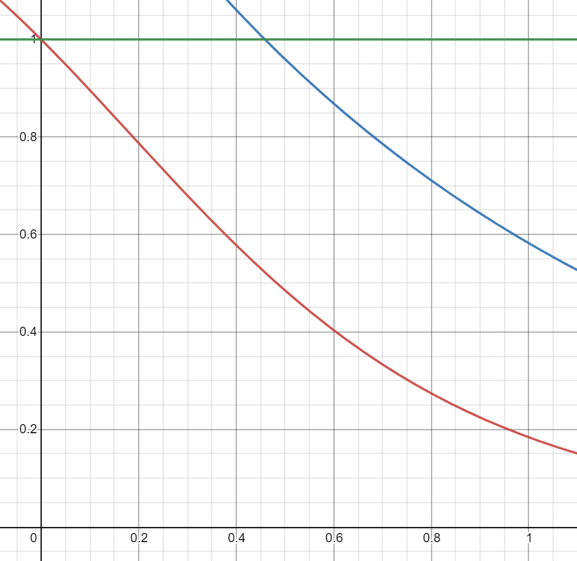

---
header-includes:
- \usepackage{xeCJK} 
- \usepackage{fontspec} 
- \setCJKmainfont{微軟正黑體} 
- \XeTeXlinebreaklocale "zh"
- \XeTeXlinebreakskip = 0pt plus 1pt
title: "Statistical Computing HW2"
author: "106033233 資工21 周聖諺"
date: "4/3/2021"
output:
  pdf_document: 
   latex_engine: xelatex
  html_document:
    df_print: paged
---

```{r setup, include=FALSE}
knitr::opts_chunk$set(echo = TRUE)
options(tinytex.verbose = TRUE)
```

```{r ess_func, echo=FALSE, results='hide'}
idx2element <- function(idxs, list){
  return(list[idxs])
}
```

## Problem 1:

設 $h(x) = \frac{e^{-x}}{1+x^2}$

設 $X$ 為一個 random variable 服從分布的 PDF $g(X)$, 假設我們想要 estimate the expectation of $h(X)$ over the distribution $g(X)$ 於區間 $(a, b)$, 也就是 $E_g[h(X)]$.

$$
E_g[h(X)] = \int_a^b h(x) g(x) dx = \int_a^b \frac{h(x) g(x)}{f(x)} f(x) dx = E_f[\frac{h(x) g(x)}{f(x)}]
$$

其中 $f(x)$ 是 importance function. 其積分為

$$
\int_a^b h(x) g(x) dx = \int_a^b \frac{h(x) g(x)}{f(x)} f(x) dx = E_f[\frac{h(X) g(X))}{f(X)}]
$$

$$
= \frac{1}{n} \sum^n_{i=1} \frac{h(X_i) g(X_i)}{f(X_i)}, \ X_1, ..., X_n \stackrel{i.i.d}{\sim} f
$$

**Pseudo Code**

- 從分布 $f$ 採樣 $X_1, X_2, ...X_n$
- 計算 $\frac{1}{n} \sum^n_{i=1} \frac{h(X_i) g(X_i)}{f(X_i)}$

### (a) 

設 importance function 為 $f_0(x) = 1$, 其中 $0 < x < 1$ 且 $X \sim U(0, 1)$. 因此

$$
\int_0^1 h(x) dx = \int_0^1 \frac{h(x)}{f_0(x)} f_0(x) dx = E_{f_0}[\frac{h(X)}{f_0(X)}] 
$$

$$
\approx \frac{1}{n} \sum_{i=1}^{n} h(X_i), \ X_1,...,X_n \stackrel{i.i.d}{\sim} U(0, 1) = f_0(X_i) = 1
$$

根據積分結果，我們可以用MC計算出以下結果

```{r q1_samp_f0, echo=FALSE, results='markup'}
h <- function(x){
  return(exp(-x) / (1+x*x))
}

f0 <- function(x){
  return(1)
}

y0 <- function(x){
  return(h(x) / f0(x))
}

sampling_0 <- function(n){
  samples <- vector("numeric", length=n)
  samples <- runif(n, 0, 1)
  #print(samples)/
  
  return(mean(sapply(samples, y0)))
}

n <- 10000
res <- sampling_0(n)

print("The Result of Integral with Importance Function f_0")
print(res)
```

### (b)

假設 importance function 為 $f_1(x) = e^{-x}$, 其中 $0 < x < \infty$ 且 $X \sim U(0, 1)$. 因此

$$
\int_0^1 h(x) dx = \int_0^1 \frac{h(x)}{f_1(x)} f_1(x) dx = E_{f_1}[\frac{h(X)}{f_1(X)}] 
$$

$$
\approx \frac{1}{n} \sum_{i=1}^{n} \frac{h(X_i)}{f_1(X_i)}, \ X_1,...,X_n \stackrel{i.i.d}{\sim} Exp(1) = f_1(X_i)
$$

$f_1(z)$ 為 truncated Exponential Distribution, 其中 $0 < z < 1$

$$
\int_0^1 e^{-x} dx = -e^{-x} |_0^1 = -e^{-1} + e^{0} = -e^{-1} + 1
$$

然後, normalized by $\int_0^1 e^{-x} dx$. 可以得到 Importance Function 為

$$
f_1(z) = \frac{e^{-z}}{\int_0^1 e^{-x} dx} = \frac{e^{-z}}{1-e^{-1}}
$$

根據積分結果，我們可以用MC計算出以下結果

```{r q1_samp_f1, echo=FALSE, results='markup'}
library(ReIns)

f1 <- function(x){
  return(exp(-x) / (1 - exp(-1)))
}

y1 <- function(x){
  return(h(x) / f1(x))
}

sampling_1 <- function(n){
  samples <- vector("numeric", length=n)
  #samples <- rexp(n, 1)
  #samples <- samples[samples <= 1]
  samples <- rtexp(n, rate = 1, endpoint=1)
  
  return(mean(sapply(samples, y1)))
}
res <- sampling_1(n)

print("The Result of Integral with Importance Function f_1")
print(res)
```

### (c)

將(a)、(b)有不一樣 importance function 的 important sampling 做了各1000次，計算出 Mean 和 Variance 。

```{r q1_c, echo=FALSE, results='markup'}
m <- 1000
boostrap_0 <- rep(n, m)
boostrap_0 <- sapply(boostrap_0, sampling_0)

boostrap_1 <- rep(n, m)
boostrap_1 <- sapply(boostrap_1, sampling_1)

# Means & Variances
mean0 <- format(mean(boostrap_0), nsmall=3)
var0 <- format(var(boostrap_0), nsmall=3)
scale0 <- format(scale(boostrap_0), nsmall=3)

mean1 <- format(mean(boostrap_1), nsmall=3)
var1 <- format(var(boostrap_1), nsmall=3)
scale1 <- format(scale(boostrap_1), nsmall=3)

print(cat("MC with f0, MEAN: ", mean0, ", VAR: ", var0))
print(cat("MC with f1, MEAN: ", mean1, ", VAR: ", var1))

hist(boostrap_0, main="MC with f_0", xlab="Result of Integral", breaks=20, freq = FALSE)
#h$density = h$counts/sum(h$counts)*100
#plot(h,freq=FALSE)

hist(boostrap_1, main="MC with f_1", xlab="Result of Integral", breaks=20, freq = FALSE)
```

可觀察到兩者的 Mean 相當接近，但(b)的Variance較(a)小一個order，可以合理推測應是(b)的important function 較為接近目標函數$\int_0^1 \frac{e^{-x}}{1+x^2} dx$，因此在期望值附近採樣的機會較高，使得其在期望值附近採樣的次數較多所致。



上圖為綠線為$y = 1$, 紅線為$\frac{e^{-x}}{1+x^2}$，藍線為$\frac{e^{-x}}{1-e^{-1}}$，可觀察到藍線及紅線趨勢相當接近。

## Problem 2:

### (a)

考慮一個線性回歸模型有參數 $X$ 與 $Y$

$$
Y_i = \beta_0 + X_i \beta_1 + \epsilon_i = f(X_i)
$$

設 random variables 為 $X_i \sim N(0, \sigma_X^2)$ 且 $\epsilon_i \sim N(0, \sigma_{\epsilon}^2)$。 其中有常數 $\beta_0 = 1$, $\beta_1 = 2$, and $\sigma_{\epsilon}^2 = 1$, $\sigma_X^2 = 2$

然後, 為了用 OLS 去 estimate $\hat{\beta_1}$。 設 random vectors 為 $X = \{X_1, ..., X_n\}$, $Y = \{Y_1, ..., Y_n\}$, and $e = \{\epsilon_1, ..., \epsilon_n\}$. 用 quadratic form 表達則為

$$
Y = \beta_0 + X \beta_1 + e
$$

$\beta_1$ 的 Least Squares Criterion 為 

$$
Q(\beta_1) = \sum_{i=1}^n (f(x_i) - y_i)^2 = (\beta_0 + X \beta_1 - Y)^{\top} (\beta_0 + X \beta_1 - Y)
$$

其中 OLS 的目標是尋找 $\hat{\beta_1}$ 使其滿足以下關係

$$
\hat{\beta_1} = \arg\min_{\beta_1} \ Q(\beta_1)
$$

$$
\frac{\partial Q(\beta_1)}{\partial \beta_1} = 0
$$

$$
\frac{\partial Q(\beta_1)}{\partial \beta_1} = \frac{d}{d \beta_1} (\beta_0 + X \beta_1 - Y)^{\top} (\beta_0 + X \beta_1 - Y)
$$

帶入已知 $\beta_0$ 的解為

$$
\bar{Y} = \beta_0 + \beta_1 \bar{X}
$$

則可導出

$$
= \frac{d}{d \beta_1} ((\bar{Y} - \beta_1 \bar{X}) + X \beta_1 - Y)^{\top} ((\bar{Y} - \beta_1 \bar{X}) + X \beta_1 - Y)
$$

$$
= \frac{d}{d \beta_1} ((\bar{Y} - Y) + \beta_1 (X - \bar{X}))^{\top} ((\bar{Y} - Y) + \beta_1 (X - \bar{X}))
$$

$$
= 2 ((\bar{Y} - Y) + \beta_1 (X - \bar{X}))^{\top} (X - \bar{X})
$$

$$
= 2 ((\bar{Y} - Y)^{\top} (X - \bar{X}) + \beta_1 (X - \bar{X})^{\top} (X - \bar{X}))
$$

接著，最小化 Mean Square Error

$$
2 ((\bar{Y} - Y)^{\top} (X - \bar{X}) + \hat{\beta_1} (X - \bar{X})^{\top} (X - \bar{X})) = 0
$$

$\hat{\beta_1}$ 的估測值為

$$
\hat{\beta_1} = \frac{(Y - \bar{Y})^{\top} (X - \bar{X})}{(X - \bar{X})^{\top} (X - \bar{X})} = \frac{Cov[X, Y]}{Var[X]}
$$

**Pseudo Code**

- Generate dataset $(X, Y)$
- Compute $\frac{Cov[X, Y]}{Var[X]}$

若用 Simulation 方法生出樣本 $(X, Y)$ ，並 Estimate $\hat{\beta_1}$ 200次，其 Sample mean 與 Sample variance 為以下

```{r q2_a, echo=FALSE, results='markup'}
# Global Variables
mean_e <<- 0
sigma_e2 <<- 1

mean_x <<- 0
sigma_x2 <<- 2

beta_0 <<- 1
beta_1 <<- 2

gen_y <- function(x){
  epsilon <- rnorm(1, mean_e, sigma_e2)
  return(beta_0 + x * beta_1 + epsilon)
}

gen_ys <- function(xs){
  return(sapply(xs, gen_y))
}

inverse_v <-function(v){
  return(1/v)
}

OLS_beta_0 <- function(xs, ys){
  return(mean(ys) - OLS_beta_1(xs, ys) * mean(xs))
}

OLS_beta_1 <- function(xs, ys){
  #return(1/sum(xs * xs) * sum(xs * (ys - beta_0)))
  return(cov(xs, ys) / var(xs))
}

bootstrap_beta_1_est <- function(xs, ys){
  #xs <- rnorm(n, mean_x, sigma_x2)
  #ys <- gen_ys(xs)
  
  return(OLS_beta_1(xs, ys))
}

adapter_q2a <- function(data, n){
  return(bootstrap_beta_1_est(data[1:n], data[(n+1):(2*n)]))
}

bootstrap_beta_1_ests <- function(n, m, sample_xs, sample_ys){
  sample_xys <- rbind(sample_xs, sample_ys)
  
  return(apply(sample_xys, 2, adapter_q2a, n))
}

n <- 500
m <- 200

sample_xs <- sapply(1:m, function(i){return(rnorm(n, mean_x, sigma_x2))})
sample_ys <- sapply(1:m, function(i){return(beta_0 + beta_1 * sample_xs[, i] + rnorm(n, mean_e, sigma_e2))})

ests <- bootstrap_beta_1_ests(n, m, sample_xs, sample_ys)

print(cat("The OLS Estimate With Bootstrap: Mean=", mean(ests), "Variance=", var(ests)))
hist(ests, main="Regression of Beta1", xlab="Value of Beta1", breaks=20, freq = FALSE)
```

### (b)

Simulation 的結果以 Histogram 呈現結果如(a)的圖表所示，基本上 Simulation 200的期望值相當接近 ground truth。Variance 也非常小，因此，對$\hat{\beta_1}$的估計精確度還不錯。

同時，如果多做幾次模擬如下

```{r q2_b, echo=FALSE, results='markup'}
bootstrap_beta_1_est_2b <- function(n){
  xs <- rnorm(n, mean_x, sigma_x2)
  ys <- gen_ys(xs)
  
  return(OLS_beta_1(xs, ys))
}

bootstrap_beta_1_ests_2b <- function(n, m){
  ests <- rep(n, m)
  return(sapply(ests, bootstrap_beta_1_est_2b))
}

get_bootstrap_var <- function(i){
  bootstrap_var <- var(bootstrap_beta_1_ests_2b(n, m)) 
  return(bootstrap_var)
}

ests_vars <- sapply(1:100, get_bootstrap_var)

print(cat("The Estimate Variance Var[Beta_1] of OLS Estimate With Bootstrap: Mean=", mean(ests_vars), "Variance=", var(ests_vars)))

hist(ests_vars, main="The Estimate Variance Var[Beta_1] of OLS Estimate", xlab="Value of Var[Beta_1]", breaks=20, freq = FALSE)
```

可以發現 $Var[Var[\hat{\beta_1}]]$ 的數值仍舊相當小，換句話說，Simulation 對於估計 $\hat{\beta_1}$ 的 Exact Distribution 表現還是相當不錯。

### (c)

**Asymptotic Method**

首先 $\hat{\beta_1}$ 為

$$
\hat{\beta_1} = (X^{\top} X)^{-1} X^{\top} (Y - \beta_0)
$$

同時，我們可以將 $\bar{Y}$ 表示為以下式子

$$
\bar{Y} = \frac{1}{n} \sum_{i=1}^n (\beta_0 + \beta_1 x_i + \epsilon_i) = \beta_0 + \beta_1 \bar{X} + \bar{e}
$$

因此，我們可以導出 $Y - \bar{Y}$ 如下

$$
Y - \bar{Y} = (\beta_0 + \beta_1 X + e) - (\beta_0 + \beta_1 \bar{X} + \bar{e}) = \beta_1 (X - \bar{X}) + (e - \bar{e})
$$

並將 $Y - \bar{Y}$ 代入 $\hat{\beta_1}$

$$
\hat{\beta_1} = \frac{(Y - \bar{Y})^{\top} (X - \bar{X})}{(X - \bar{X})^{\top} (X - \bar{X})} = \frac{(\beta_1 (X - \bar{X}) + (e - \bar{e}))^{\top} (X - \bar{X})}{(X - \bar{X})^{\top} (X - \bar{X})}
$$

$$
= \beta_1 + \frac{(e - \bar{e})^{\top} (X - \bar{X})}{(X - \bar{X})^{\top} (X - \bar{X})}
$$

由於 $\hat{e} = 0$, 我們可以導出

$$
(e - \bar{e})^{\top} (X - \bar{X}) = e^{\top} (X - \bar{X}) - \bar{e}^{\top} (X - \bar{X}) = e^{\top} (X - \bar{X})
$$

$$
= \beta_1 + \frac{e^{\top} (X - \bar{X})}{(X - \bar{X})^{\top} (X - \bar{X})}
$$

By CLT, $\hat{\beta_1}$ 會 converge 到 normal distribution. 接下來可導出 $\hat{\beta_1}$ 的mean 和 variance 如下

由於 $\beta_1$ 為常數, dataset $X$ 為 nonstochastic, 而 $E[e] = 0$

$$
E[\hat{\beta_1}] = \beta_1 + E[\frac{e^{\top} (X - \bar{X})}{(X - \bar{X})^{\top} (X - \bar{X})}] = \beta_1 + E[e] \frac{(X - \bar{X})}{(X - \bar{X})^{\top} (X - \bar{X})} = \beta_1
$$

因此，estimator 為 unbiased.

然後, variance 為

$$
Var[\hat{\beta_1}] = E[(\hat{\beta_1} - E[\hat{\beta_1}])^2]
$$

$$
= E[(\beta_1 + \frac{e^{\top} (X - \bar{X})}{(X - \bar{X})^{\top} (X - \bar{X})} - \beta_1])^2]
$$

$$
= E[(\frac{e^{\top} (X - \bar{X})}{(X - \bar{X})^{\top} (X - \bar{X})} ])^2]
$$

$$
= \frac{\sigma_{\epsilon}^2}{\sum_{i=1}^n (x_i - \bar{X})^2}
$$

因此, asymptotic distribution 為

$$
\hat{\beta_1} \sim N(\frac{(Y - \bar{Y})^{\top} (X - \bar{X})}{(X - \bar{X})^{\top} (X - \bar{X})}, \frac{\sigma_{\epsilon}^2}{\sum_{i=1}^n (x_i - \bar{X})^2})
$$

**Pseudo Code Of Asymptotic Method**

- Resample observations $(Y, X)$
- For each bootstrap sample
  - Estimate parameters $\beta_1, \beta_0$ with asymptotic distribution

以下則是用 asymptotic method 跑出的結果

```{r q2_c_asy, echo=FALSE, results='markup'}
asymptotic_beta_1_est <- function(xs, ys){
  xs_bar <- mean(xs)
  
  asy_mean <- cov(xs, ys) / var(xs)
  asy_var <- sigma_e2 / (sum((xs - xs_bar) * (xs - xs_bar)))
  
  #print(asy_mean)
  #print(asy_var)
  
  return(asy_var)
}

adapter_asy <- function(data, n){
  return(asymptotic_beta_1_est(data[1:n], data[(n+1):(2*n)]))
}

#asymptotic_beta_1_ests <- function(n, m, xs, ys){
asymptotic_beta_1_ests <- function(n, m, sample_xs, sample_ys){
  #seq <- 1:n
  #sample_idxs <- replicate(m, sample(seq, n, replace=TRUE))
  
  #sample_xs <- apply(sample_idxs, 2, idx2element, xs)
  #sample_ys <- apply(sample_idxs, 2, idx2element, ys)
  
  sample_xys <- rbind(sample_xs, sample_ys)
  
  #return(sapply(ests, asymptotic_beta_1_est))
  return(apply(sample_xys, 2, adapter_asy, n))
}

n <- 500
m <- 200

#xs <- rnorm(n, mean_x, sigma_x2)
#ys <- gen_ys(xs)

#sample_xs <- sapply(1:m, function(i){return(rnorm(n, mean_x, sigma_x2))})
#sample_ys <- sapply(1:m, function(i){return(beta_0 + beta_1 * sample_xs[, i] + rnorm(n, mean_e, sigma_e2))})

ests <- asymptotic_beta_1_ests(n, m, sample_xs, sample_ys)

print(cat("The Estimate Variance Var[Beta_1] of OLS Estimate With Asymptotic Method: Mean=", mean(ests), "Variance=", var(ests)))

hist(ests, main="The Estimate Variance Var[Beta_1] of OLS Estimate", xlab="Value of Var[Beta_1]", breaks=20, freq = FALSE)
```

Asymptotic Method 所 Estimate 出來的 Variance $Var[\hat{\beta_1}]$ 與 (a) 相當接近。 而 $Var[Var[\hat{\beta_1}]]$ 也相當接近 Simulate 出來的結果，基本上可以證實 Exact Distribution 會逐漸接近 Normal 的結論。

同時，如果使用 Resampling 的作法採樣並計算 Asymptotic Distribution 的話

```{r q2_c_asy_v2, echo=FALSE, results='markup'}
# Version 2

asymptotic_beta_1_est_ver2 <- function(xs, ys){
  xs_bar <- mean(xs)
  
  asy_mean <- cov(xs, ys) / var(xs)
  asy_var <- sigma_e2 / (sum((xs - xs_bar) * (xs - xs_bar)))
  
  #print(asy_mean)
  #print(asy_var)
  
  return(asy_var)
}

adapter_ver2 <- function(data, n){
  return(asymptotic_beta_1_est_ver2(data[1:n], data[(n+1):(2*n)]))
}

asymptotic_beta_1_ests_ver2 <- function(n, m, xs, ys){
  seq <- 1:n
  sample_idxs <- replicate(m, sample(seq, n, replace=TRUE))
  
  sample_xs <- apply(sample_idxs, 2, idx2element, xs)
  sample_ys <- apply(sample_idxs, 2, idx2element, ys)
  
  sample_xys <- rbind(sample_xs, sample_ys)
  
  return(apply(sample_xys, 2, adapter_ver2, n))
}

n <- 500
m <- 200

xs <- rnorm(n, mean_x, sigma_x2)
ys <- gen_ys(xs)
ests <- asymptotic_beta_1_ests_ver2(n, m, xs, ys)

print(cat("The Estimate Variance Var[Beta_1] of OLS Estimate With Asymptotic Method: Mean=", mean(ests), "Variance=", var(ests)))

hist(ests, main="The Estimate Variance Var[Beta_1] of OLS Estimate", xlab="Value of Var[Beta_1]", breaks=20, freq = FALSE)
```

得到的結果和用 Simulation 相當接近，可以證明 Resampling 和 Simulation 兩種生產樣本的方法應是幾乎等價。

### (d)

**Pseudo Code Of Observation Resampling (Random X)**

- Resample observations $(Y, X)$
- For each bootstrap sample
  - Estimate parameters $\beta_1, \beta_0$

```{r q2_d_obs, echo=FALSE, results='markup'}
# Observation Resampling
adapter <- function(data, n){
  #print(data)
  #print(data[1:n])
  #print(data[(n+1):(2*n)])
  return(bootstrap_beta_1_est_rand(data[1:n], data[(n+1):(2*n)]))
}

bootstrap_beta_1_est_rand <- function(xs, ys){
  return(OLS_beta_1(xs, ys))
}

bootstrap_beta_1_ests_rand <- function(n, m, xs, ys){
  seq <- 1:n
  sample_idxs <- replicate(m, sample(seq, n, replace=TRUE))
  
  sample_xs <- apply(sample_idxs, 2, idx2element, xs)
  #print(sample_xs)
  sample_ys <- apply(sample_idxs, 2, idx2element, ys)
  #print(sample_ys)
  sample_xys <- rbind(sample_xs, sample_ys)
  
  #ests <- replicate(m, sample(xs, n, replace=TRUE))
  return(apply(sample_xys, 2, adapter, n))
}

n <- 500
m <- 200
xs <- rnorm(n, mean_x, sigma_x2)
ys <- gen_ys(xs)

ests_o <- bootstrap_beta_1_ests_rand(n, m, xs, ys)

# Observation Resampling
print(cat("The OLS Estimate With Observation Resampling: Mean=", mean(ests_o), "Variance=", var(ests_o)))
hist(ests_o, main="OLS Estimate of Beta1 With Observation Resampling", xlab="Value of Beta1", breaks=20, freq = FALSE)

#Average Variance
avg_var_o <- mean(replicate(100, var(bootstrap_beta_1_ests_rand(n, m, xs, ys))))
print(cat("The Averge Variance of OLS Estimate With Observation Resampling: ", avg_var_o))
```

**Pseudo Code Of Residual Resampling (Fixed X)**

- Estimate the model $Y = \hat{f}(X)$ via observation $(X, Y)$
- Generate and resmple residuals $R = Y - \hat{f}(X)$
- For each bootstrap residual sample
  - Generate bootstrap samples by $Y^* = Fit + Residual = \hat{f}(X) + R$
  - Estimate parameters $\beta_1, \beta_0$ with $(X, Y^*)$

```{r q2_d_res, echo=FALSE, results='markup'}
# Residual Resampling
gen_residuals <- function(n, xs, ys){
  est_beta_1 <- OLS_beta_1(xs, ys)
  est_beta_0 <- OLS_beta_0(xs, ys)
  
  residuals <- sapply(1:n, function(i) return(ys[i] - (est_beta_0 + est_beta_1 * xs[i])))
  return(residuals)
}

bootstrap_beta_1_ests_fixed <- function(n, m, xs, ys){
  # Estimate the model
  est_beta_1 <- OLS_beta_1(xs, ys)
  est_beta_0 <- OLS_beta_0(xs, ys)
  residuals <- gen_residuals(n, xs, ys)
    
  sample_xs <- replicate(m, xs)
  sample_residuals <- replicate(m, sample(residuals, n, replace=TRUE))
  
  sample_ys <- apply(sample_xs, 2, function(x, est_beta_0, est_beta_1) return(est_beta_0 + est_beta_1 * x), est_beta_0, est_beta_1)
  
  sample_ys <- sample_ys + sample_residuals
  
  sample_xys <- rbind(sample_xs, sample_ys)
  
  return(apply(sample_xys, 2, adapter, n))
}

ests_r <- bootstrap_beta_1_ests_fixed(n, m, xs, ys)

print(cat("The OLS Estimate With Residual Resampling: Mean=", mean(ests_r), "Variance=", var(ests_r)))
hist(ests_r, main="OLS Estimate of Beta1 With Residual Resampling", xlab="Value of Beta1", breaks=20, freq = FALSE)

# Average Variance
avg_var_r <- mean(replicate(100, var(bootstrap_beta_1_ests_fixed(n, m, xs, ys))))
print(cat("The Averge Variance of OLS Estimate With Residual Resampling: ", avg_var_r))
```

經以上實作顯示，Residual Resampling 的 Variance 確實會比 Observation Resampling 稍低，因為 Residual Resampling 比起 Observation Resampling 多假設了線性模型的假設做重抽模擬，所以 Variance 理應較低一些。實際多次模擬取平均(Average Variance)後，也會發現平均變異數都是 Residual Resampling 的 Variance 比較低一些。

### (e)

根據 OLS，我們的目標是最小化$Q(\beta_1)$，因此

$$
\frac{\partial Q(\beta_1)}{\partial \beta_1} = \sum_{i=1}^n 2 (x_i - \bar{X})(\bar{Y} - \beta_1 \bar{X} - y_i)
$$

$$
= \sum_{i=1}^n 2(x_i - \bar{X})(\beta_1 (x_i - \bar{X}) - (y_i - \bar{Y}))
$$

Perturbation Bootstrap, 令 $G_i$ 為一 random variable，且 $E[G_i] = 1, Var[G_i] = 1$

$$
\sum_{i=1}^n (x_i - \bar{X})(\hat{\beta_1} (x_i - \bar{X}) - (y_i - \bar{Y})) G_i = 0
$$

$$
\sum_{i=1}^n \hat{\beta_1} (x_i - \bar{X})^2 G_i -  (x_i - \bar{X}) (y_i - \bar{Y}) G_i = 0
$$

$$
\hat{\beta_1} \sum_{i=1}^n (x_i - \bar{X})^2 G_i =  \sum_{i=1}^n (x_i - \bar{X}) (y_i - \bar{Y}) G_i
$$

$$
\hat{\beta_1} = \frac{\sum_{i=1}^n (x_i - \bar{X}) (y_i - \bar{Y}) G_i}{\sum_{i=1}^n (x_i - \bar{X})^2 G_i}
$$

**Pseudo Code Of Perturbation Bootstrap**

- Resample observations $(Y, X)$
- For each bootstrap sample
  - Estimate parameters $\beta_1$ with $\hat{\beta_1} = \frac{\sum_{i=1}^n (x_i - \bar{X}) (y_i - \bar{Y}) G_i}{\sum_{i=1}^n (x_i - \bar{X})^2 G_i}$
  
以下實作令$G_i \stackrel{i.i.d} \sim Exp(1) = e^{-x}$

```{r q2_e, echo=FALSE, results='markup'}
# Perturbation Bootstraping
OLS_beta_1_perturb <- function(xs, ys){
  #beta_0 <- 1
  len <- length(xs)
  perturbs <- rexp(len, 1)
  mean_x <- mean(xs)
  mean_y <- mean(ys)
  
  w_cov <- sum((xs - mean_x) * (ys - mean_y) * perturbs)
  w_var <- sum((xs - mean_x) * (xs - mean_x) * perturbs)
  #return(w_cov/weighted.var(xs, perturbs))
  return(w_cov/w_var)
}

bootstrap_beta_1_est_perturb <- function(xs, ys){
  return(OLS_beta_1_perturb(xs, ys))
}

adapter_perturb <- function(data, n){
  return(bootstrap_beta_1_est_rand(data[1:n], data[(n+1):(2*n)]))
}

bootstrap_beta_1_ests_perturb <- function(n, m, xs, ys){
  seq <- 1:n
  sample_idxs <- replicate(m, sample(seq, n, replace=TRUE))
  
  sample_xs <- apply(sample_idxs, 2, idx2element, xs)
  #print(sample_xs)
  sample_ys <- apply(sample_idxs, 2, idx2element, ys)
  #print(sample_ys)
  sample_xys <- rbind(sample_xs, sample_ys)
  
  #ests <- replicate(m, sample(xs, n, replace=TRUE))
  return(apply(sample_xys, 2, adapter_perturb, n))
}

n <- 500
m <- 200
#xs <- rnorm(n, mean_x, sigma_x2)
#ys <- gen_ys(xs)

ests <- bootstrap_beta_1_ests_perturb(n, m, xs, ys)

print(cat("The OLS Estimate With Perturbation Bootstrap: Mean=", mean(ests), "Variance=", var(ests)))
hist(ests, main="OLS Estimate of Beta1 With Perturbation Bootstrap", xlab="Value of Beta1", breaks=20, freq = FALSE)

# Averge Variance
avg_var_r <- mean(replicate(100, var(bootstrap_beta_1_ests_perturb(n, m, xs, ys))))
print(cat("The Averge Variance of OLS Estimate With Perturbation Bootstrap: ", avg_var_r))
```

Perturbation Bootstrap 的 estimate 仍舊相當接近 residual/observation resampling，而 Average Variance 則比 Residual Resampling 略高，與 observation resampling 差不多。

綜合上述觀察和模擬，基本上可以發現，雖然各個方法的 Mean 和 Variance 雖然有高有低，但基本上都相當接近(a)用原始 Linear Model 直接進行模擬的結果。

# Code

**Some Utility Functions**

```{r ess_func, eval=FALSE}
```

# Problem 1

## (a)

```{r q1_samp_f0, eval=FALSE}
```

## (b)

```{r q1_samp_f1, eval=FALSE}
```

## (c)

```{r q1_c, eval=FALSE}
```

# Problem 2

## (a)

```{r q2_a, eval=FALSE}
```

## (b)

```{r q2_b, eval=FALSE}
```

## (c)

**Asymptotic**

```{r q2_c_asy, eval=FALSE}
```

**Resample**

```{r q2_c_asy_v2, eval=FALSE}
```

## (d)

**Observation Resampling**

```{r q2_d_obs, eval=FALSE}
```

**Residual Resampling**

```{r q2_d_res, eval=FALSE}
```

## (e)

```{r q2_e, eval=FALSE}
```
